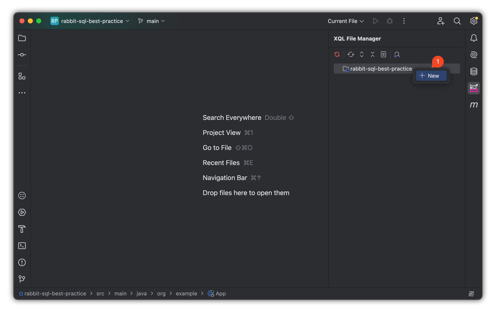
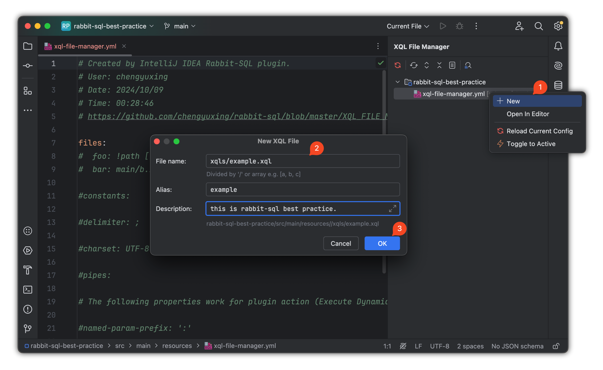
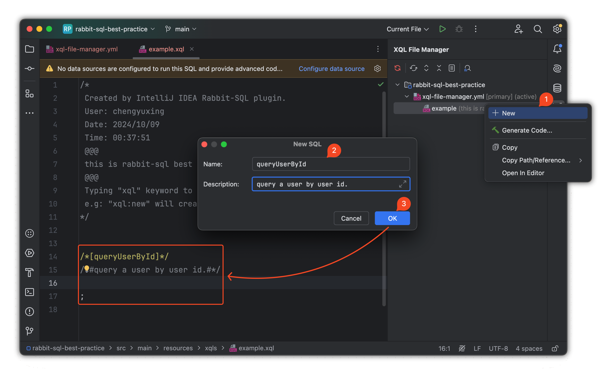
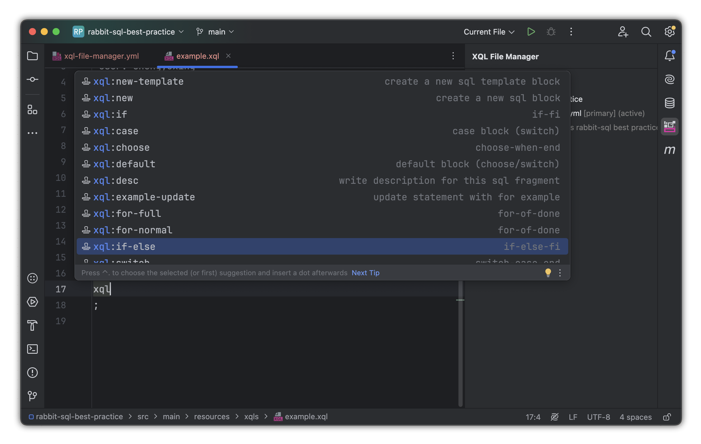
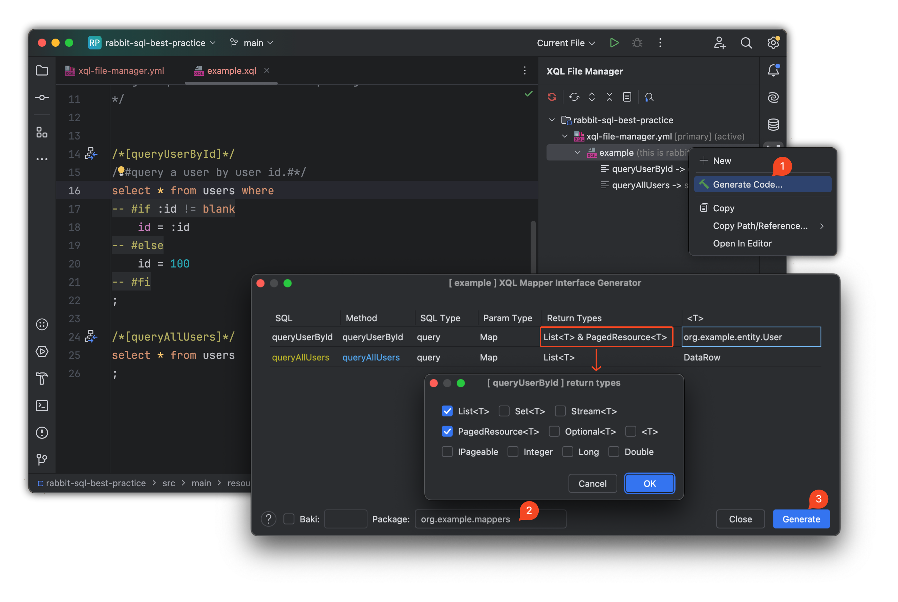
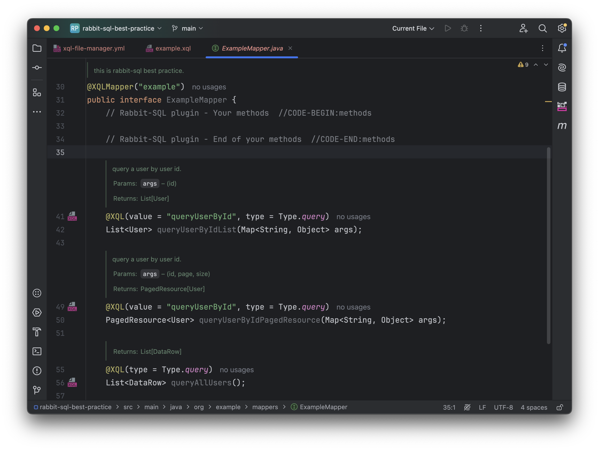
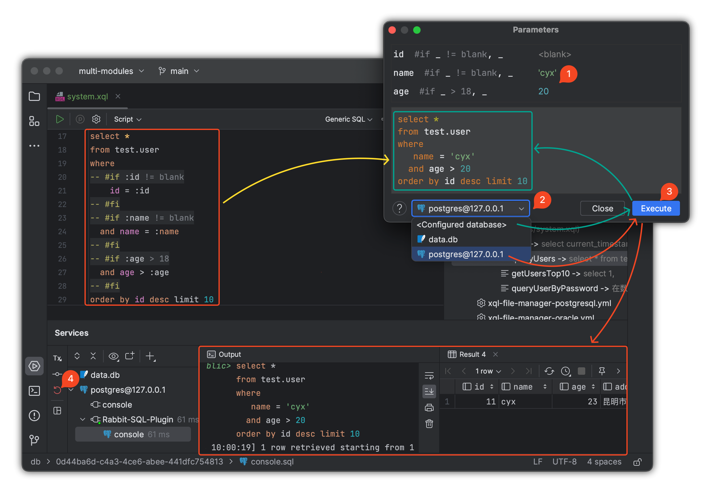

# rabbit-sql 最佳实践

<a href="https://rabbitsql.cn" target="_blank"></a>

语言：[English](https://github.com/chengyuxing/rabbit-sql/blob/master/BEST_PRACTICE.md) | 简体中文

## 准备工作

**开发工具**：IDEA Ultimate 版本 2023.1 以上。

**Java版本**：8 以上。

**安装插件**

- 通过IDEA插件商店进行安装：<kbd>Preferences(Settings)</kbd> > <kbd>Plugins</kbd> > <kbd>Marketplace</kbd> > <kbd>Search and find <b>"rabbit sql"</b></kbd> > <kbd>Install Plugin</kbd>；
- 通过插件[资源库][versions]手动下载安装：<kbd>Preferences(Settings)</kbd> > <kbd>Plugins</kbd> > <kbd>⚙️</kbd> > <kbd>Install plugin from disk...</kbd> > 选择插件安装包（不需要解压）。

## 项目初始化

创建maven项目。

### 使用spring boot starter

**pom.xml**：

_java 8+_

```xml
<dependency>
    <groupId>com.github.chengyuxing</groupId>
    <artifactId>rabbit-sql-spring-boot-starter</artifactId>
    <version>5.1.0</version>
</dependency>
```

使用 **rabbit-sql** 提供的 [Spring Boot Starter][rabbit-sql-sbt-md]，可以简化配置，快速集成项目。通过 `application.yml` 或 `application.properties` 来配置数据库连接。

**示例配置**：

```yaml
spring:
  datasource:
    url: jdbc:postgresql://127.0.0.1:5432/postgres
    username: chengyuxing
    password: 
```

### 创建XQL文件管理配置

1. 在 `.../src/main/resources` 目录下创建文件 [xql-file-manager.yml][xql-file-manager] ，通过插件快速生成：

   

2. 创建xql文件，通过插件来创建xql文件并自动注册到 [xql-file-manager.yml][xql-file-manager]，降低手动配置的错误率:

   

**项目结构**：

- 建议将 `.xql` 文件统一放置在一个目录中，如 `/resources/xqls/`，并按照模块或功能分类，方便维护和管理。

- 将每个 `.xql` 文件的名称与模块功能对应，例如 **user.xql**、**order.xql**，以便于查找和维护。

**目录结构**：

```
/src
  ├─ main/
  |    ├─ java/org/example/
  |    └─ resources/xqls/
  |           ├─ user.xql
  |           └─ order.xql
```

### XQL文件编写最佳实践

#### SQL语句命名

- 在 `.xql` 文件中，使用清晰的 SQL 语句名称，有助于提高可读性和可维护性。

- 使用注释标记 SQL 语句名称，并为此条SQL添加具体描述。

- 通过插件来创建一条SQL模版：

  

```sql
/*[findAllUsers]*/
/*#Some description.#*/
SELECT * FROM users;

/*[queryUserById]*/
/*#Some description.#*/
SELECT * FROM users WHERE id = :id;
```

> SQL语句参数使用的是[命名参数][param] `:id`，将被预编译处理为 `?` 号，可有效避免SQL注入的风险。

#### 动态SQL

- [动态 SQL][dynamic-sql] 可以通过 `#if` 和 `#for` 等标签实现条件查询和循环查询，确保代码的灵活性。

- 在复杂查询中，推荐将公共的 SQL 片段拆分成可复用的 SQL 片段，避免重复代码。

- 通过插件提供的 **live template** 来生成标签语句模版，输入 `xql` 关键字来获取建议：

  

**示例**：

```sql
select * from users where
-- #if :id >= 100
  id = 99
-- #else
  id = :id
-- #fi
```

#### SQL语句与接口方法映射

- 默认情况下，sql名与方法名一一对应，否则使用 `@XQL` 注解进行方法映射，确保 SQL 语句名称始终与方法有明确的对应。
- 按照约定，[方法名的前缀][interface-mapping]代表了sql的类型，例如：`queryUsers();` ，框架内部判定为 `select` 将执行查询操作，或者使用注解  `@XQL` 来改变默认的的查询行为。
- 当一个 SQL 语句需要映射到多个方法时，使用 `@XQL` 注解指定 SQL 名称。

当 SQL 编写好以后，使用插件来快速生成**接口文件**和**方法注释文档**，减少重复操作，提高效率：



> Return Types: 选择需要返回的类型，有些 SQL 在一些情况是存在复用需要返回不同类型的需求。
>
> T: 默认情况下，返回类型泛型内置了 `DataRow` 和 `Map`，如果需要返回 java bean，则需要写**完全限定类名**，如上图 `org.example.entity.User`。
>
> 可重复点击 **Generate Code...**，每次都会记录上一次的配置。

**映射接口**：

- `@XQLMapper(...)` 表明这是一个映射接口，并且指定具体的xql文件别名。



>  左侧导航图标表明sql和方法映射成功。
>
> 同一条 SQL 不同返回类型的复用，插件生成的接口格式为 **SQL名+返回类型**。
>
> 每次重新点击 **Generate Code...** ，接口文件 `//CODE-BEGIN ... //CODE-END` 区域之间的内容不会被覆盖，例如：
>
> ```java
> // Rabbit-SQL plugin - Your methods  //CODE-BEGIN:methods
> int addUser(User user);
> // Rabbit-SQL plugin - End of your methods  //CODE-END:methods
> ```

接口映射的更多使用方法和注意事项可具体参考文档[接口映射][interface-mapping]。

### 接口使用指南

#### 动态代理接口

在springboot启动类上添加注解 `@XQLMapperScan` ，所有被标记了 `@XQLMapper` 的接口都会被扫描到spring上下文中，即可通过依赖注入注入接口。

```java
@SpringBootApplication
@XQLMapperScan
public class App {
    public static void main(String[] args) {
        SpringApplication.run(App.class, args);
    }
}
```

`ExampleService.java`

```java
@Autowired
private ExampleMapper exampleMapper;
```

#### Baki核心接口

除了接口映射之外，默认还提供了可选择的核心[接口Baki][baki]。

- 通过 Baki 接口来执行增删改查、事务操作等基本数据库操作，避免直接与 JDBC 交互。
- 每个 SQL 操作都通过传递 SQL 名称来执行，并传入参数映射。

**SQL名示例**：

```java
@Autowired
private Baki baki;

public Stream<DataRow> getUsersByName() {
    return baki.query("&example.queryAllUsers").args().stream();
}
```

#### 事务处理

- 推荐在复杂的业务操作中使用 Baki 提供的事务支持，确保数据一致性。
- 可以通过注解或手动方式进行事务管理。

**示例**：

```java
// 通过 Spring 注解管理事务
@Transactional
public void a() {
    
}
```

```java
// 通过手动管理事务
// com.github.chengyuxing.sql.spring.Tx
@Autowired;
Tx tx;

public void b(){
   tx.using(()->{

   });
}
```

#### 性能优化

##### 惰性查询

如果对查询结果需要进行二次处理转换等操作，推荐返回类型为 **Stream**，减少循环的次数，提升性能。

##### 批量操作

对于批量插入、更新等操作，推荐使用批量提交，减少数据库的网络交互次数，提升性能。

```java
baki.insert('<tableName>', <Collection>);
```

```java
baki.execute("&<sql名>", <Collection>);
```

> insert, update, delete 通过传入集合来执行批量操作。

##### 缓存重复查询

针对频繁执行的相同查询，推荐使用应用层缓存或数据库查询缓存，减少重复 SQL 请求，提升系统响应速度。

实现接口：`com.github.chengyuxing.sql.plugins.QueryCacheManager` 来实现自定义的缓存层，并注册到 `BakiDao#setQueryCacheManager` 来启用缓存。

##### SQL优化

- 在 `.xql` 文件中，尽量使用索引字段进行查询，避免全表扫描。
- 定期检查数据库的执行计划，优化慢查询。

#### 错误处理与调试

##### 错误日志

- 确保所有 SQL 执行都被记录到日志中，尤其是异常发生时，方便排查问题。
- 使用 [rabbit-sql 插件][versions]进行[动态SQL][dynamic-sql]测试和调试，及时发现潜在问题。

##### 常见错误处理

- **SQL 语法错误**：在 .xql 文件中书写 SQL 时，确保 SQL 语法正确，尤其是在[使用动态 SQL][dynamic-sql]时。

- **参数映射问题**：使用 [:参数名][param] 时，确保传递的参数名与 SQL 中的占位符匹配，避免 SQL 语句的参数未正确绑定。

- **连接释放问题**：使用 **Stream** 作为返回类型时，需要在使用完毕后进行释放，一般使用 `try-with-resource` 来进行释放连接：

  ```java
  try(Stream<DataRow> s = ...){
    s.map(...).
  }
  ```

## 插件使用指南

[插件][plugin]功能几乎都可以直接通过 IDEA 工具栏 **XQL File Manager** 面板来进行操作。

- 使用 [rabbit-sql-plugin][versions] 提供的 SQL 名自动完成、SQL 引用跳转和动态 SQL 测试功能，提升开发效率。
- 通过插件导航直接跳转到对应的 SQL 语句，方便开发和调试。
- 通过 **New** 来创建 `xql-file-manager.yml` ，XQL文件，SQL模版。

### 测试动态SQL

有效利用[插件][plugin]进行[动态SQL][dynamic-sql]测试，确保在项目启动前最大化降低错误率，尤其是针对复杂动态SQL的计算，提前明白每个参数对动态SQL计算结果的影响。

- 选择第 **2** 步配置数据源的情况下可查看具体的执行效果，或者查看动态SQL的计算结果。

- 通过 **Execute '...'** 来测试动态SQL。

- 测试完毕点击第 **4** 步来回滚事务，以避免执行非查询语句造成数据被修改的问题。

  

## 安全性最佳实践

### 防止SQL注入

- 使用[参数化查询][param]，确保所有的参数都通过 `:参数名` 占位符进行传递，避免 SQL 注入漏洞。
- 禁止在 SQL 中直接拼接用户输入，所有用户输入都应该通过参数占位符传递。

### 数据库连接池配置

- 配置合理的数据库连接池，避免数据库连接过多或连接泄漏，影响系统的可用性。

- 使用 Spring Boot 的连接池配置，设置合理的最小和最大连接数。

  ```yaml
  spring:
    datasource:
      hikari:
        minimum-idle: 5
        maximum-pool-size: 20
        connection-timeout: 30000
        idle-timeout: 600000
        max-lifetime: 1800000
  ```

## 版本控制与部署

- **定期更新依赖**：确保 rabbit-sql 的依赖库和插件保持最新版本，定期检查是否有安全漏洞或功能增强。
- **自动化测试**：对使用 rabbit-sql 的业务逻辑编写单元测试和集成测试，确保数据库操作的正确性和系统稳定性。

## 结语

**rabbit-sql** 是一个强大而灵活的持久层框架，通过遵循以上最佳实践，可以确保您的项目具有高效、可维护、性能优越的数据库交互逻辑。随时保持对最新功能和优化的关注，并根据项目需求灵活应用这些实践。

## 参考

- [快速上手 demo][demo]
- [[Github] rabbit-sql 文档][rabbit-sql-md]
- [[Github] rabbit-sql-spring-boot-starter 文档][rabbit-sql-sbt-md]
- [[Gitee] rabbit-sql 文档][gitee-rabbit-sql-md]
- [[Gitee] rabbit-sql-spring-boot-starter 文档][gitee-rabbit-sql-sbt-md]
- [IDEA rabbit-sql 插件][plugin]
- [springboot 官方文档][springboot-org]

[versions]:https://plugins.jetbrains.com/plugin/21403-rabbit-sql/versions
[interface-mapping]:https://github.com/chengyuxing/rabbit-sql/blob/master/README.chs.md#接口映射
[baki]:https://github.com/chengyuxing/rabbit-sql/blob/master/README.chs.md#baki
[param]:https://github.com/chengyuxing/rabbit-sql/blob/master/README.chs.md#sql参数占位符
[dynamic-sql]:https://github.com/chengyuxing/rabbit-sql/blob/master/README.chs.md#动态sql
[xql-file-manager]:https://github.com/chengyuxing/rabbit-sql/blob/master/README.chs.md#xqlfilemanager
[rabbit-sql-md]:https://github.com/chengyuxing/rabbit-sql/blob/master/README.chs.md
[rabbit-sql-sbt-md]:https://github.com/chengyuxing/rabbit-sql-spring-boot-starter/blob/main/README.chs.md
[plugin]:https://plugins.jetbrains.com/plugin/21403-rabbit-sql
[gitee-rabbit-sql-md]:https://gitee.com/cyxo/rabbit-sql/blob/master/README.chs.md
[gitee-rabbit-sql-sbt-md]:https://gitee.com/cyxo/rabbit-sql-spring-boot-starter/blob/main/README.chs.md
[springboot-org]:https://spring.io/projects/spring-boot#learn
[demo]:https://github.com/chengyuxing/rabbit-sql-quickstart
[jpa]:https://github.com/chengyuxing/rabbit-sql/blob/master/README.chs.md#jpa
