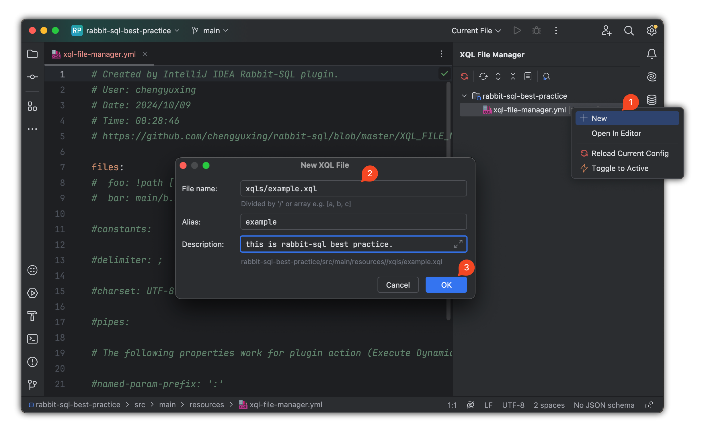
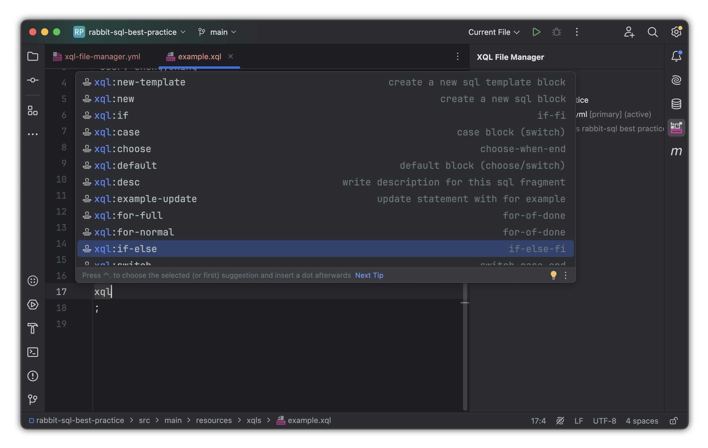

# rabbit-sql Best practice


Language：English | [简体中文](https://github.com/chengyuxing/rabbit-sql/blob/master/BEST_PRACTICE.chs.md)

## Getting Started

**Development tool**：IDEA Ultimate 2023.1+.

**Java version**：8+.

**Plugin installing**

- Installing from IDEA plugin marketplace: <kbd>Preferences(Settings)</kbd> > <kbd>Plugins</kbd> > <kbd>Marketplace</kbd> > <kbd>Search and find <b>"rabbit sql"</b></kbd> > <kbd>Install Plugin</kbd>.
- Installing manually, download from [plugin repository][versions]: <kbd>Preferences(Settings)</kbd> > <kbd>Plugins</kbd> > <kbd>⚙️</kbd> > <kbd>Install plugin from disk...</kbd> > choose installation package. (no need to unzip)

## Project initialization

Create maven project.

### Use spring boot starter

**pom.xml**：

_java 8+_

```xml
<dependency>
    <groupId>com.github.chengyuxing</groupId>
    <artifactId>rabbit-sql-spring-boot-starter</artifactId>
    <version>5.0.5</version>
</dependency>
```

Use [Spring Boot Starter][rabbit-sql-sbt-md] provided by **rabbit-sql**, simplify configuration and quickly integrate projects. Configure the database through `application.yml` or `application.properties` .

**Example**:

```yaml
spring:
  datasource:
    url: jdbc:postgresql://127.0.0.1:5432/postgres
    username: chengyuxing
    password: 
```

### Create XQL File Manager

1. Create [xql-file-manager.yml][xql-file-manager] in `.../src/main/resources` by using plugin quickly generate:

   

2. Create xql files by using plugin and automatically register [xql-file-manager.yml][xql-file-manager] to reduce the error rate of manual configuration.

   

**Project structure**:

- You are advised to store `.xql` files in a directory, such as `/resources/xqls/`, and classify them by module or function for easy maintenance and management.
- Correspond the name of each `.xql` file to the module function, such as **user.xql**, **order.xql**, for easy lookup and maintenance.

**Directory structure**:

```
/src
  ├─ main/
  |    ├─ java/org/example/
  |    └─ resources/xqls/
  |           ├─ user.xql
  |           └─ order.xql
```

### XQL file writing Best practices

#### SQL statement naming

- Use clear SQL statement names in `.xql` files to help improve readability and maintainability.

- Use comments to mark the name of the SQL statement and add a specific description to the SQL.

- Create SQL Template by using plugin:

  

```sql
/*[findAllUsers]*/
/*#Some description.#*/
SELECT * FROM users;

/*[queryUserById]*/
/*#Some description.#*/
SELECT * FROM users WHERE id = :id;
```

> SQL statement use [named parameter][param] `:id` , it will be compiled as `?` for effectively avoid the risk of SQL injection.

#### Dynamic SQL

- [Dynamic SQL][dynamic-sql] can implement conditional and loop queries through tags such as `#if` and `#for` to ensure code flexibility.

- In complex queries, it is recommended to split common SQL fragments into reusable SQL fragments to avoid duplicate code.

- Create tag template language by **live template** provided by plugin, typing `xql` keyword to get suggestions:

  

**Example**:

```sql
select * from users where
-- #if :id >= 100
  id = 99
-- #else
  id = :id
-- #fi
```

#### SQL with Mapping Interface

- By default，the sql name corresponds to the method name one by one. Otherwise, the `@XQL` annotation is used for method mapping to ensure that the SQL statement name always corresponds to the method clearly.
- By convention, [the prefix of the method name][interface-mapping] represents the type of sql, for example: `queryUsers();` ,the framework determines that `select` will perform the query operation, or use the `@XQL` annotation to change the default query behavior.
- When an SQL statement needs to be mapped to multiple methods, use the `@XQL` annotation to specify the SQL name.

When the SQL is written, Quickly generate **interface** and **documentation** by using plugin, it can be reduce repetitive operations and increase efficiency:


> Return Types: Check the type you want to return, some SQL in some cases have reuse needs to return different types of requirements.
>
> T: By default, `DataRow` and `Map` are built-in Return Generic Type, if java bean you want to return the **fully qualified class name** is necessary, e.g. `org.example.entity.User` .
>
> **Generate Code...** can be repeatedly clicked , each time the last configuration is recorded.

**Mapping Interface**：

- `@XQLMapper(...)` Indicates that this is a mapping interface and specifies the specific xql file alias.


>  The navigation icon on the left indicates that the sql and method mapping is successful.
>
> Reuse one SQL which has the different return types, the plugin will generate the method that format is **SQL Name + Return Type**.
>
> The area of `//CODE-BEGIN ... //CODE-END` in interface that content will not be overwritten when re-**generate Code...** , e.g: 
>
> ```java
> // Rabbit-SQL plugin - Your methods  //CODE-BEGIN:methods
> int addUser(User user);
> // Rabbit-SQL plugin - End of your methods  //CODE-END:methods
> ```

Get more information about interface mapping from documentation [interface mapping][interface-mapping].

### Interface usage guide

#### Dynamic proxy interface

All interfaces annotated with `@XQLMapper` will be scanned to spring application context when springboot startup main class annotated with `@XQLMapperScan` , and then inject the interface to use.

```java
@SpringBootApplication
@XQLMapperScan
public class App {
    public static void main(String[] args) {
        SpringApplication.run(App.class, args);
    }
}
```

`ExampleService.java`

```java
@Autowired
private ExampleMapper exampleMapper;
```

#### Baki core interface

Except for interface mapping, by default the [Baki][baki] is provided also.

- Using the Baki interface to perform basic database operations such as add, delete, modify, and transaction operations, avoiding direct interaction with JDBC.
- Each SQL operation is performed by passing in the SQL name, along with the parameter mapping.

**Named SQL Example**:

```java
@Autowired
private Baki baki;

public Stream<DataRow> getUsersByName() {
    return baki.query("&example.queryAllUsers").args().stream();
}
```

#### Transaction

- It is recommended to use the transaction support provided by Baki in complex business operations to ensure data consistency.
- Transaction management can be done via annotations or manually.

**Example**:

```java
// By annotation
@Transactional
public void a() {
    
}
```

```java
// Manually
// com.github.chengyuxing.sql.spring.Tx
@Autowired;
Tx tx;

public void b(){
   tx.using(()->{

   });
}
```

#### Performance optimization

##### Lazy query

If operations such as secondary processing and conversion are required for query results, it is recommended that the return type be **Stream** to reduce the number of loops and improve performance.

##### Batch operation

Batch submission is recommended for operations such as batch insert and update to reduce the number of network interactions and improve database performance.

```java
baki.insert('<tableName>', <Collection>);
```

```java
baki.execute("&<sql名>", <Collection>);
```

> insert, update, delete batch operations are performed by passing in the collection.

##### Cache repeat query

For the same queries that are frequently executed, you are advised to use application-layer cache or database query cache to reduce repeated SQL requests and improve system response speed.

Implement interface: `com.github.chengyuxing.sql.plugins.QueryCacheManager` to create cache layer and invoke `BakiDao#setQueryCacheManager`  to enable the cache support.

##### SQL optimization

- In `.xql` files, try to use index fields for queries to avoid full table scanning.

- Periodically check the execution plan of the database to optimize slow queries.

#### Error handling and debugging

##### Error log

- Ensure that all SQL execution is logged, especially if an exception occurs, to facilitate troubleshooting.
- Use the [rabbit-sql plugin][versions] for [dynamic SQL][dynamic-sql] testing and debugging to detect potential problems in time.

##### Common error handling

- **SQL syntax error**: When you write SQL in.xQL files, make sure the SQL syntax is correct, especially if you are using [dynamic SQL][dynamic-sql].

- **Param mapping problem**: When using [:parameter name][param], ensure that the passed parameter names match the placeholders in the SQL to avoid incorrect binding of parameters in the SQL statement.

- **Connection release problem**: When using **Stream** as the return type, it needs to be released after use, generally using `try-with-resource` to release the connection:

  ```java
  try(Stream<DataRow> s = ...){
    s.map(...).
  }
  ```

## Plugin usage guide

[Plugin][plugin] functions can almost always be operated directly through the IDEA toolbar **XQL File Manager** panel.

- Use the SQL name auto-completion, SQL reference jump, and [dynamic SQL][dynamic-sql] testing functions provided by [rabbit-sql-plugin][versions] to improve development efficiency.
- Jump directly to the corresponding SQL statement through the plugin navigation, which is convenient for development and debugging.
- Create `xql-file-manager.yml`, XQL file, SQL template with **New** action.

### Test dynamic SQL

Effective use of [plugin][plugin] for [dynamic SQL][dynamic-sql] testing to ensure maximum error rate before project start, especially for complex dynamic SQL calculations, understanding in advance the impact of each parameter on the results of dynamic SQL calculations.

- Select **2**nd step to configure the data source to view the execution result or the calculation result of the dynamic SQL.

- Test dynamic sql by click  **Execute '...'** .

- Click **4**th step action to rollback transaction when test finished, to avoid data modification problems caused by the execution of non-query statements.

  

## Security Best practice

### Prevent SQL injection

- Use [parameterized][param] queries to ensure that all parameters are passed through `:parameter` name placeholders to avoid SQL injection vulnerabilities.
- Direct concatenation of user input in SQL is prohibited; all user input should be passed through parameter placeholders.

### Datasource configuration

- Configure a proper database connection pool to prevent excessive database connections or connection leaks, which may affect system availability.

- Use Spring Boot's connection pool configuration to set a reasonable minimum and maximum number of connections.

  ```yaml
  spring:
    datasource:
      hikari:
        minimum-idle: 5
        maximum-pool-size: 20
        connection-timeout: 30000
        idle-timeout: 600000
        max-lifetime: 1800000
  ```

## Version control and deployment

- **Periodic update dependency**: Make sure rabbit-sql's dependencies and plugins are up to date, and check regularly for security vulnerabilities or enhancements.
- **Automated testing**: Write unit tests and integration tests for business logic using rabbit-sql to ensure the correctness of database operations and system stability.

## Conclusion

**rabbit-sql** is a powerful and flexible persistence layer framework, and by following these best practices, you can ensure that your project has efficient, maintainable, high-performance database interaction logic. Stay on top of the latest features and optimizations at all times, and flexibly apply these practices according to project needs.

## Reference

- [Quickstart demo][demo]
- [[Github] rabbit-sql][rabbit-sql-md]
- [[Github] rabbit-sql-spring-boot-starter][rabbit-sql-sbt-md]
- [[Gitee] rabbit-sql][gitee-rabbit-sql-md]
- [[Gitee] rabbit-sql-spring-boot-starter][gitee-rabbit-sql-sbt-md]
- [IDEA rabbit-sql plugin][plugin]
- [springboot official documentation][springboot-org]

[versions]:https://plugins.jetbrains.com/plugin/21403-rabbit-sql/versions
[interface-mapping]:https://github.com/chengyuxing/rabbit-sql#interface-mapping
[baki]:https://github.com/chengyuxing/rabbit-sql#baki
[param]:https://github.com/chengyuxing/rabbit-sql#sql-parameter-holder
[dynamic-sql]:https://github.com/chengyuxing/rabbit-sql#dynamic-sql
[xql-file-manager]:https://github.com/chengyuxing/rabbit-sql#xqlfilemanager
[rabbit-sql-md]:https://github.com/chengyuxing/rabbit-sql
[rabbit-sql-sbt-md]:https://github.com/chengyuxing/rabbit-sql-spring-boot-starter
[plugin]:https://plugins.jetbrains.com/plugin/21403-rabbit-sql
[gitee-rabbit-sql-md]:https://gitee.com/cyxo/rabbit-sql
[gitee-rabbit-sql-sbt-md]:https://gitee.com/cyxo/rabbit-sql-spring-boot-starter
[springboot-org]:https://spring.io/projects/spring-boot#learn
[demo]:https://github.com/chengyuxing/rabbit-sql-quickstart
[jpa]:https://github.com/chengyuxing/rabbit-sql#jpa