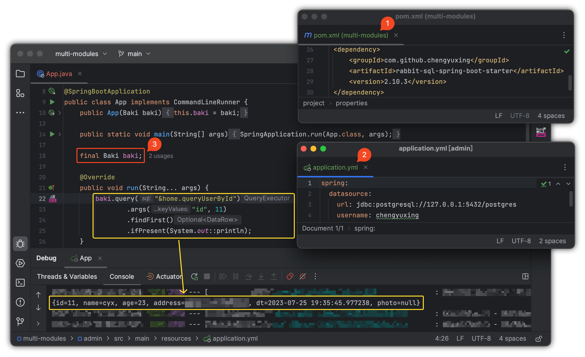
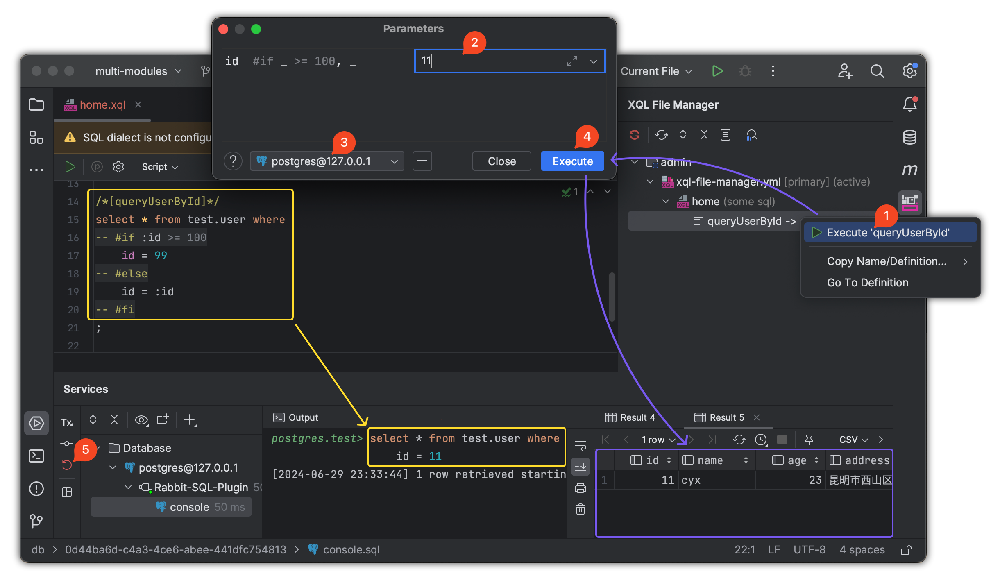
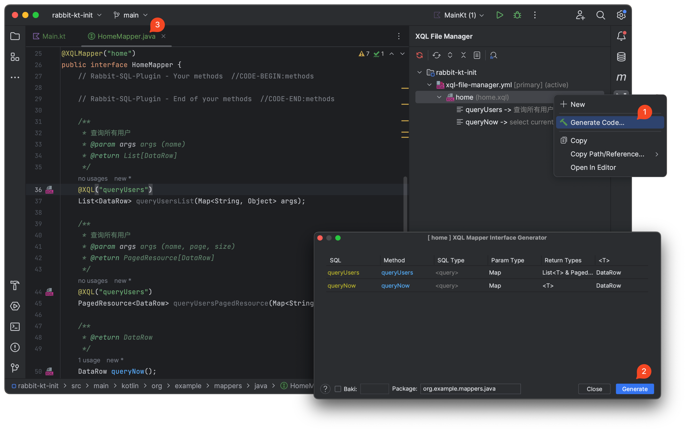
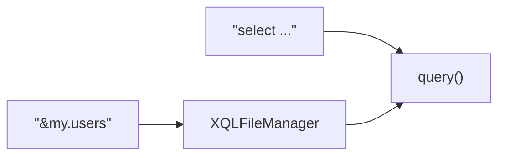
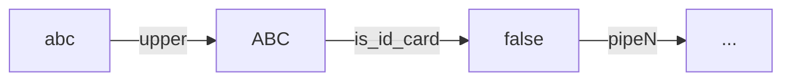

# rabbit-sql

[![License][badge:license]][license]
[![Maven][badge:maven]][maven-repository]
[![Version][badge:version]][versions]

<a href="https://rabbitsql.cn" target="_blank"></a>

语言：[English](https://github.com/chengyuxing/rabbit-sql) | 简体中文

## 介绍

查看[最佳实践](https://github.com/chengyuxing/rabbit-sql/blob/master/BEST_PRACTICE.chs.md)或者[demo](https://github.com/chengyuxing/rabbit-sql-quickstart)来快速开始。

这是一个轻量级的持久层框架，提供了完整的数据库操作解决方案，通过封装和抽象，简化了数据库访问的复杂性，同时也为开发者提供了灵活性和可扩展性，以追求简单稳定高效为目标，此库基本功能如下：

- [执行存储过程/函数](#调用存储过程函数)
- 简单的[事务](#事务)
- [预编译sql](#预编译SQL)
- [代码与sql分离](#XQLFileManager)
- [动态sql解析](#动态SQL)
- [接口映射](#接口映射)
- [实体映射](#实体映射)

## Maven dependency

_java 8+_

```xml
<dependency>
    <groupId>com.github.chengyuxing</groupId>
    <artifactId>rabbit-sql</artifactId>
    <version>10.0.2</version>
</dependency>
```

## Spring-Boot(2.7+)支持

- 支持rabbit-sql自动装配；
- 兼容spring jdbc事务；
- 兼容mybatis、spring-data-jpa等同时进行事务处理；



具体使用方法和配置可以参考[文档](https://github.com/chengyuxing/rabbit-sql-spring-boot-starter)。

## IDEA插件支持

动态sql测试：



xql接口代码生成：



插件商店搜索 [Rabbit sql](https://plugins.jetbrains.com/plugin/21403-rabbit-sql)，帮助文档：[Rabbit sql plugin](https://github.com/chengyuxing/rabbit-sql-plugin/blob/main/README.chs.md)。

## 快速上手

有两种方式，面向Baki接口和面向xql映射接口，同时使用也并不冲突。

### 初始化

```java
Datasource datasource = new HikariDataSource();
...
BakiDao baki = new BakiDao(dataSource);

XQLFileManager xqlFileManager = new XQLFileManager("xql-file-manager.yml");
...
baki.setXqlFileManager(xqlFileManager);
```

### 接口映射

支持已注册到**XQLFileManager**的**xql**文件映射（`BakiDao#proxyXQLMapper`）到标记了注解`@XQLMapper`的接口，通过动态代理调用方法来执行相应的查询等操作。

```java
ExampleMapper mapper = baki.proxyXQLMapper(ExampleMapper.class)
```

如果使用 Springboot 则，可以直接通过在启动类上加上注解 ` @XQLMapperScan` 通过接口扫描机制自动注册到上下文中，注入接口即可，具体可以参考[文档](https://github.com/chengyuxing/rabbit-sql-spring-boot-starter)。

`example.xql`

```sql
/*[queryGuests]*/
select * from test.guest where id = :id;

/*[addGuest]*/
insert into test.guest(name, address, age)values (:name, :address, :age);
```

`ExampleMapper.java`

```java
@XQLMapper("example")
public interface ExampleMapper {
  List<DataRow> queryGuests(Map<String, Object> args);
  
  @XQL(value = "queryGuests")
  Optional<Guest> findById(@Arg("id") int id);
  
  @XQL(type = SqlStatementType.insert)
  int addGuest(DataRow dataRow);
}
```

默认情况下，所有方法均根据前缀来确定执行类型，并且**SQL名字**和**接口方法**一一对应，如果不对应的情况下，使用注解`@XQL(value = "sql名",type = SqlStatementType.insert)` 来指定具体的sql名字和覆盖默认的查询行为，接口方法定义需遵循如下规范：

| sql类型              | 方法前缀                                                  |
| -------------------- | --------------------------------------------------------- |
| select               | select \| query \| find \| get \| fetch \| search \| list |
| insert               | insert \| save \| add \| append \| create                 |
| update               | update \| modify \| change                                |
| delete               | delete \| remove                                          |
| procedure / function | call \| proc \| func                                      |

**参数类型**：

- 参数字典：`DataRow|Map<String,Object>|<JavaBean>`
- 参数列表：使用注解 `@Arg` 标记每个参数的名字

| 返回类型                                               | sql类型（Type）                               | 备注                  |
| ------------------------------------------------------ | --------------------------------------------- | --------------------- |
| `List<DataRow/Map<String,Object>/<JavaBean>>`          | query                                         |                       |
| `Set<DataRow/Map<String,Object>/<JavaBean>>`           | query                                         |                       |
| `Stream<DataRow/Map<String,Object>/<JavaBean>>`        | query                                         |                       |
| `Optional<DataRow/Map<String,Object>/<JavaBean>>`      | query                                         |                       |
| `Map<String,Object>`                                   | query                                         |                       |
| `PagedResource<DataRow/Map<String,Object>/<JavaBean>>` | query                                         | `@CountQuery`（可选） |
| `IPageable`                                            | query                                         | `@CountQuery`（可选） |
| `Long`, `Integer`, `Double`                            | query                                         |                       |
| `<JavaBean>`                                           | query                                         |                       |
| `DataRow`                                              | query, procedure, function, plsql, ddl, unset |                       |
| `int/Integer`                                          | insert, update, delete                        |                       |

如果接口方法标记了以下特殊注解，将忽略接口的映射关系，并执行此注解的具体操作：

- `@Procedure`
- `@Function`

### Baki

访问数据库的基础接口。

#### 原生SQL查询

```java
baki.query("select … where id = :id").arg("id", "1")
```

```java
baki.query("&my.users")
```



> 除了可以传入一个sql语句以外，还支持以 `&` 符号开头的格式，这代表获取并执行[sql文件管理器](#XQLFileManager)中的一条sql。

**示例**

- 流查询

```java
try(Stream<DataRow> fruits = baki.query("select * from fruit").stream()){
        fruits.forEach(System.out::println);
        }
```

> 只有当进行终端操作时才会真正的开始执行查询，推荐使用 **try-with-resource** 语句进行包裹，在查询完成后将自动释放连接对象。

- 分页查询

默认的分页查询将自动根据数据库生成**分页查询语句**和生成 **count** 查询语句。

内置支持 oracle，mysql，postgresql，sqlite，mariadb，db2，其他可通过实现接口 `com.github.chengyuxing.sql.plugins.PageHelperProvider` 并添加到[BakiDao](#BakiDao)进行支持。

```java
PagedResource<DataRow> resource = baki.query("select ... where id < :id")
                .arg("id", 8)
                .pageable(1, 7)
                .collect();
```

- 自定义分页查询

`/pgsql/data.sql`

```sql
/*[custom_paged]*/
with t as (
  select * from test.region
  where id > :id limit :limit offset :offset
  )
select * from t;
;
```

```java
PagedResource<DataRow> res = baki.query("&data.custom_paged")
  		          .pageable(1, 7)
                .count("select count(*) ... where id > :id")
                .disableDefaultPageSql() //禁用默认生成的分页sql
                .collect();
```

> `disableDefaultPageSql()` 意味着不对 custom_paged 这条sql进行分页构建。
>
> **count** 查询语句也需要用户主动传入。 

#### 调用存储过程/函数

```java
baki.call("{:res = call test.sum(:a, :b)}",
      Args.of("res", Param.OUT(StandardOutParamType.INTEGER))
              .add("a", Param.IN(34))
              .add("b", Param.IN(56))
      ).getOptional("res")
      .ifPresent(System.out::println);
```

> 如果是**postgresql**数据库，返回值有游标需要使用[事务](#事务)进行包裹。

### 实体映射

本框架为了做到最纯粹的执行 SQL ，内部将不再硬编码实体映射逻辑，以到达与各种框架做到最大的兼容性。

实体映射核心为 `DataRow` 类，其提供了方法 `toEntity` 和 `ofEntity` ，如果有特殊实体映射需求，通过配置属性 `BakiDao#entityFieldMapper` 来实现自定义解析。

例如 JPA 的标准实体有注解 `@Column` ，那么简单的映射实现如下：

```java
class MyEntityFieldMapper implements EntityFieldMapper {
    @Override
    public String apply(Field field) {
        if (field.isAnnotationPresent(Column.class)) {
            Column column = field.getAnnotation(Column.class);
            return column.name();
        }
        return field.getName();
    }
}
```

在其他框架中，甚至自定义字段注解解析也可以满足需求，不再受限于其他框架的实体映射规则。

### 事务

事务的使用请遵循线程的隔离性。

```java
Tx.using(() -> {
  ......
});
```

## SQL参数占位符

### 预编译SQL

预编译sql的语法使用**命名参数**，例如：

`:name` (jdbc标准的命名参数写法，sql将被预编译安全处理，参数名为：`name` )

> 最终被编译为 `?`，极力推荐使用预编译sql，可以有效避免sql注入的风险。

### 字符串模版

`${[!]name}` (通用的字符串模版占位符，不进行预编译，可用于sql片段的复用)

字符串模版有2种格式：

- `${name}` 如果类型是**装箱类型数组(String[], Integer[]...)**或**集合(Set, List...)**，则先展开（逗号分割），再进行sql片段的替换；
- `${!name}` 名字前多了前缀符号( `!` )，如果类型是**装箱类型数组(String[], Integer[]...)**或**集合(Set, List...)**，则先展开（逗号分隔），并做一定的字符串安全处理，再进行sql片段的替换。

#### 示例

sql：

```sql
select ${fields} from ... where word in (${!words}) or id = :id;
```

参数：

```java
Args.<Object>of("id","uuid")
  .add("fields", Arrays.asList("name", "age"))
  .add("words", Arrays.asList("I'm OK!", "book", "warning"));
```

> 特殊变量类型：`com.github.chengyuxing.sql.types.Variable`, 可实现自定义的格式化内容。

最终生成的sql：

```sql
select name, age from ... where id in ('I''m Ok!', 'book', 'warning') or id = ?;
```

## 动态SQL

动态sql的工作依赖于[XQLFileManager](#XQLFileManager)，通过解析特殊的注释标记，在不破坏sql文件标准的前提下进行动态编译。

### 注释标记

注释标记都必须成对出现，都具有开闭标签，缩进不是必要的，只为了有层次感。

需要特别说明过一下，值类型字符串字面量如果不是纯数字和关键字（`null`, `blank`, `true`, `false`）的话，可以不需要加引号，默认为字符串，例如 `:name = bob`, `'bob'` 的引号不是必要的。

#### check

前置条件检查语句，如果满足条件则抛出异常信息（`CheckViolationException`）。

在数据库真正执行sql之前，对参数做一次合法性验证，避免数据库层面的参数类型错误异常，以节省资源。

```sql
-- #check :id > 10 throw 'ID cannot gt 10.'
...
```

#### var

变量定义语句，变量值可以是常量，也可以是传入的参数经过管道处理，通过扩展管道，实现各种复杂的变量定义。

```sql
-- #var list = 'cyx,jack,mike' | split(',')
-- #var newId = :id
select * from table where id = :newId and name in (
-- #for item of :list
  :item
-- #done
)
```

#### if-else-fi

IF 条件判断语句，逻辑效果和程序语言的 if 一样。

```sql
-- #if :user <> null
    ...
-- #else (可选)
    ...
-- #fi
```

#### guard-throw

守卫语句：如果条件满足则执行分支处理逻辑，否则执行 `#throw` 抛出异常信息并终止后面的所有操作。

```sql
-- #guard :user <> blank
    ...
-- #throw 'message'
```

#### switch-case-end

switch 流程控制语句，效果和程序语言的 switch 一样，按顺序匹配每个 case 分支，当第一个条件满足则直接跳出整个 switch 。

```sql
-- #switch :name
       -- #case 'a', 'b', c
       ...
       -- #break	
       -- #case 'd'
       ...
       -- #break
       ...
       -- #default
       ...
       -- #break
-- #end
```

#### choose-when-end

choose 流程控制语句，效果类似于 switch 语句，按顺序匹配每个 when 分支，当第一个条件满足则直接跳出整个 choose 。

```sql
-- #choose
       -- #when :id >= 0
       	...
       -- #break
       ...
       -- #default
       	...
       -- #break
-- #end
```

#### for-done

for 循环语句，效果和程序语言一样，对一个集合进行遍历，将循环体内的内容进行累加。

```sql
-- #for item,idx of :list delimiter ',' open '' close ''
	...
-- #done
```

**for表达式**语法说明：

关键字：`of` `delimiter` `open` `close`

```sql
item[,index] of :list [|pipe1|pipeN|... ] [delimiter ','] [open ''] [close '']
```

- `[...]` 表示可选配置项；
- `item` 表示当前值，`index` 表示当前序号；
- `:list` 表示当前迭代的对象，后面可以追加[管道](#管道)进行一些特殊处理；
- `delimiter` 表示循环的每项连接符，默认为 `,` ；
- `open` 表示当前循环最终结果的前缀，如果结果不为空，则被添加到前面；
- `close` 表示当前循环最终结果后缀，如果结果不为空，则被添加到后面；

### 表达式脚本

参数键名以 `:` 号开头。

 一个简单的表达式语法如下：

```sql
!(:id >= 0 || :name | length <= 3) && :age > 21
```

#### 支持的运算符

| 运算符 | 说明           |
| ------ | -------------- |
| <      | 小于           |
| >      | 大于           |
| >=     | 大于等于       |
| <=     | 小于等于       |
| ==, =  | 等于           |
| !=, <> | 不等于         |
| ~      | 正则包含       |
| !~     | 正则不包含     |
| @      | 正则匹配       |
| !@     | 正则不匹配     |

- 支持的逻辑符：`||`, `&&`, `!`

- 支持嵌套括号：`(`, `)`

- 支持数据类型：字符串（`""`、`''`），数字（12、3.14），布尔值（`true` , `false`）；

- 内置常量：`null` , `blank`(`null`、空白字符、空数组、空集合)；

> 如果操作符不能满足需求，则可以通过实现自定义管道来进行增强。

#### 管道

管道顾名思义，可以链式使用 `:id | upper | is_id_card | ...` 例如：



```sql
-- 传入的name参数经过名为 length 的管道输出长度和3进行大小比较
:name|length <= 3
```

通过实现接口 `com.github.chengyuxing.common.script.pipe.IPipe` 并添加到 [XQLFileManager](#XQLFileManager) 来使用管道。

**内置管道**：

- **length**：获取字符串的长度；
- **upper**：转大写；
- **lower**：转小写；
- **kv**：对象或 map 转为一个键值对集合 `List<KeyValue>`；
- **nvl**：如果值为 `null` 则返回默认值 ，e.g. `nvl('default')`；
- **type**：返回值的 Java 对象类型；
- **split**：根据分隔符将字符串分割为数组，e.g. `split(',')`；
- **in**：判断值是否包含在参数中，e,g, `in('a','b','c')`

### 例子

以下的例子主要以动态生成**命名参数sql**来展开进行讲解，**命名参数**最终都会被进行预编译为 `?` ，避免sql注入的风险。

**for**标签特别是在构建sql的 `in` 语句时且需要达到预编译sql的效果时特别有用：

```sql
/*[query]*/
select * from test.user where id = 1
-- #for id of :ids delimiter ', ' open ' or id in (' close ')'
    -- #if :id >= 8
    :id
    -- #fi
-- #done
```

为保持sql语法完整性，在具有语法检查的IDE中不出现高亮语法错误，推荐下面等效的写法：

```sql
select * from test.user where id = 1
-- #if :ids != blank
or id in (
    -- #for id of :ids delimiter ', '
        -- #if :id >= 8
        :id
        -- #fi
    -- #done
    )
-- #fi
;
```

```json
{"ids": [1, 2, 3, 4, 5, 6, 7, 8, 9, 10, 11, 12]}
```

以上将会生成如下sql和一些必要的变量：

```sql
select * from test.user where id = 1
 or id in (
    :_for.id_0_7, 
    :_for.id_0_8, 
    :_for.id_0_9, 
    :_for.id_0_10, 
    :_for.id_0_11
)
```

```json
{
  "_for": {
    "id_0_0": 1,
    "id_0_2": 3,
    "id_0_1": 2,
    "id_0_10": 11,
    "id_0_11": 12,
    "id_0_4": 5,
    "id_0_3": 4,
    "id_0_6": 7,
    "id_0_5": 6,
    "id_0_8": 9,
    "id_0_7": 8,
    "id_0_9": 10
  }
}
```

针对几个特别的地方进行说明：

- 当有满足项时，`open` 会在前面加上 `or id in(` , `close` 会在后面加上 `)` , 反之则不会加；
- 在sql中以 `:` 开头的变量名，意味着这是一个将会进行预编译的命名参数；

**for**也可以用来构建`update`语句：

```sql
/*[update]*/
update test.user
set
-- #for set of :sets | kv delimiter ', '
    ${set.key} = :set.value
-- #done
where id = :id;
```

```json
{
  "id": 10,
  "sets": {
    "name": "abc",
    "age": 30,
    "address": "kunming"
  }
}
```

以上将会生成如下的sql和一些必要变量：

```sql
update test.user
set
    address = :_for.set_0_0.value,
    name = :_for.set_0_1.value,
    age = :_for.set_0_2.value
where id = :id
```

```json
{
  "id": 10,
  "_for": {
    "set_0_2": {
      "key": "age",
      "value": 30
    },
    "set_0_1": {
      "key": "name",
      "value": "abc"
    },
    "set_0_0": {
      "key": "address",
      "value": "kunming"
    }
  }
}
```

说明：

- `:sets` 对应的值是一个map对象，经过 `kv` [管道](#管道)后变成了一个**键值对集合**，所以可以用于 for 表达式；

根据不同数据库进行判断来拼接适合的sql：

```sql
/*[query]*/
select * from test.user
where id = 3
-- #if :_databaseId == 'postgresql'
    ...
-- #fi
-- #if :_databaseId == 'oracle'
    ...
-- #fi
;
```

- 内置变量名 `_databaseId` 值为当前数据库的名称。

## 附录

源码各接口和属性几乎都有明确的注释文档，大多数情况下，可以通过下载源码，根据IDE智能提示来得知使用方法，这里就特别的说下其中需要注意的一些地方。

### BakiDao

 默认的Baki接口实现，提供了增删改查基本操作接口。

- 如果配置了[XQLFileManager](#XQLFileManager)的情况下，可以实现sql文件与代码分离，支持[动态sql](#动态SQL)；

- 预编译sql默认的命名参数前缀为 `:` 号，通过指定属性 `namedParamPrefix` 支持自定义，例如：

  ```sql
  where id = ?id
  ```

- [分页查询](#分页查询)如果没有受支持的数据库，则可以通过属性 `globalPageHelperProvider` 实现自定义的数据库分页帮助提供程序；

#### 配置项

##### sqlInterceptor

sql 拦截器，默认值为：

```java
(sql, args, metaData) -> true
```

##### statementValueHandler

预编译sql对象自定义参数值处理器，默认值为：

```java
(ps, index, value, metaData) -> JdbcUtil.setStatementValue(ps, index, value)
```

##### globalPageHelperProvider

默认值：`null`

全局分页帮助提供程序，如果内置的无法满足当前数据库，则实现此类来进行覆盖或扩展。

##### sqlParseChecker

默认值：`null`

当解析完成动态sql时，在真正执行之前，来进行二次处理。

##### executionWatcher

默认值：`null`

SQL执行观察者，查看每条sql的执行情况，如执行耗时等。

##### xqlFileManager

默认值：`null`

XQL文件管理器，支持统一管理SQL，根据SQL名来获取SQL执行，解析动态SQL，支持接口映射等。

##### batchSize

默认值：1000

JDBC底层执行批量操作每次提交数据数量。

##### namedParamPrefix

默认值：`:`

预编译SQL命名参数前缀，用来标记预编译参数占位符，最终被编译为 `?` 。

##### pageKey

默认值：`page`

内部分页查询**页码**默认的参数名。

##### sizeKey

默认值：`size`

内部分页查询**每页条数**默认的参数名。

##### queryTimeoutHandler

默认值：0

查询超时处理器，当查询超时，将抛出异常，具体实现效果取决于JDBC驱动：`Statement#setQueryTimeout(int)` 。

##### queryCacheManager

默认值：`null`

查询缓存管理器，缓存查询结果，以提高性能，提高并发，降低数据库压力。

合理制定缓存的自动过期策略，以免数据更新不及时。

##### entityFieldMapper

默认值：返回字段名称

框架内部接口涉及到实体返回实体的操作都将使用此函数来对字段进行映射匹配。

例如：`baki.query(...).findFirstEntity(class)`

##### entityValueMapper

默认值：`null`

框架内部接口涉及到实体返回实体的操作都将使用此函数来对字段的值类型进行映射转换。

例如：`baki.query(...).findFirstEntity(class)`

### XQLFileManager

SQL文件管理器，对普通sql文件的标准进行了**扩展**，不破坏标准的前提下通过特殊格式化的注释进行了扩展支持脚本进行逻辑判断，得以支持[动态sql](#动态SQL)，所以也是更加强大的SQL文件解析器。

因为支持.sql文件，对各类sql开发工具都有语法高亮，智能提示和错误检测，专业的dba也能轻松参与项目直接编写sql文件与javaer配合。

文件结尾以 `.sql` 或 `.xql` 结尾，文件中可以包含任意符合标准的注释，格式参考 ```template.xql```；

:bulb: 推荐使用 `.xql` 来获得[插件](#IDEA插件支持)的支持！

每个被XQLFileManager管理的sql文件都必须遵循 **"k-v"** 结构，例如`my.sql`：

```sql
/*#some description...#*/
/*[query]*/
/*#some more 
  description...#*/
select * from test."user" t ${part1};

/*第一部分*/
/*{part1}*/
where id = :id
${order};

/*{order}*/
order by id;

...
```
- Sql描述格式为 `/*#some description...#*/`;

- 对象名格式为 `/*[name]*/` ，sql文件中可以嵌套sql片段，使用 `${片段名}` 指定;

- 片段名格式为 `/*{name}*/` ，sql片段中可以嵌套sql片段，支持片段复用，使用 `${片段名}` 指定，如上例子在解析完成后名为 `query` 的sql变为：

  ```sql
  select * from test."user" t where id = :id order by id;
  ```

#### 构造函数

- **new XQLFileManager()**

  初始化默认可选配置项：

  `xql-file-manager.yml`
  
  内置`!path` 标签函数：可用于连接列表为一个路径字符串。
  
  ```yaml
  constants:
  #  base: &basePath pgsql
  
  files:
  # 使用 !path 标签合并列表得到 "pgsql/other.xql"
  #  dt: !path [ *basePath, other.xql ]
  #  other: another.xql
  
  pipes:
  #  upper: org.example.Upper
  
  delimiter: ;
  charset: UTF-8
  named-param-prefix: ':'
  database-id:
  ```
  

#### 配置项

##### files

sql文件字典集合，键为别名，值为sql文件名，可通过 `别名.sql名` 来获取sql，如上例子：`my.query`；

##### pipes

自定义[管道](#管道)字典集合，**key**为管道名，**value**为管道类名，用于动态sql脚本的参数值，通过添加实现自定义的管道来增强[动态sql表达式](#表达式脚本)的功能；

##### delimiter

sql文件 **"k-v"** 结构分隔符，**默认是单个分号（;）**遵循标准sql文件多段sql分隔符，但是有一种情况，如果sql文件内有plsql：**create function...** 或 **create procedure...**等， 内部会包含多段sql多个分号，为防止解析异常，单独设置自定义的分隔符:

- 例如（ `;;` ）双分号，也是标准sql所支持的, **并且支持仅扫描已命名的sql**。

##### constants

字符串模版常量池，如果SQL中有 `${name}` 的模版占位符，则从常量池中查找，如果找到就替换。

##### charset

解析XQL文件所使用的编码，默认：`UTF-8`。

##### namedParamPrefix

主要作用于插件解析执行命名参数动态SQL。

##### databaseId

主要作用于插件解析执行动态SQL时的参数。


[badge:maven]:https://img.shields.io/maven-central/v/com.github.chengyuxing/rabbit-sql
[badge:license]: https://img.shields.io/github/license/chengyuxing/rabbit-sql

[badge:version]:https://img.shields.io/jetbrains/plugin/v/21403
[license]:https://github.com/chengyuxing/rabbit-sql/blob/main/LICENSE
[maven-repository]:https://central.sonatype.com/artifact/com.github.chengyuxing/rabbit-sql
[versions]:https://plugins.jetbrains.com/plugin/21403-rabbit-sql/versions
