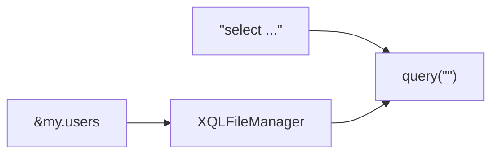
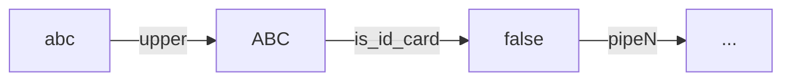

# rabbit-sql

[![License][badge:license]][license]
[![Maven][badge:maven]][maven-repository]
[![Version][badge:version]][versions]

语言：[English](README.md) | 简体中文

你不喜欢写xml，不喜欢xml和接口强绑定？

你不喜欢工具帮你生成实体和大量的接口文件？

你不喜欢在代码中拼接[动态sql](#动态SQL)？

## 前言

这仅仅只是一个小巧的工具，对**JDBC**进行了一个轻量的封装，提供一些基本操作，以追求简单稳定高效为目标（查询接口以手写sql为主），此库基本功能如下：

- 基本[接口](#BakiDao)增删改查；
- 简单[分页查询](#分页查询)；
- [流查询](#流查询)（java8的**Stream**）；
- [执行存储过程/函数](#调用存储过程函数)；
- 简单的[事务](#事务)；
- [预编译sql](#预编译SQL)；
- [代码与sql分离](#XQLFileManager)；
- [sql片段复用](#XQLFileManager)；
- [动态sql](#动态SQL)；
- 支持spring-boot框架。

## Maven dependency (jdk1.8)

Maven 中央仓库

```xml
<dependency>
    <groupId>com.github.chengyuxing</groupId>
    <artifactId>rabbit-sql</artifactId>
    <version>7.3.3</version>
</dependency>
```

## Spring-Boot(2.7+)支持

- 支持rabbit-sql自动装配；
- 支持application.yml配置项自动完成提示；
- 兼容spring jdbc事务；
- 兼容mybatis、spring-data-jpa等同时进行事务处理；

具体使用方法和配置可以参考[文档](https://github.com/chengyuxing/rabbit-sql-spring-boot-starter)。

## IDEA插件支持

插件商店搜索 [Rabbit sql](https://plugins.jetbrains.com/plugin/21403-rabbit-sql)，帮助文档：[Rabbit sql plugin](https://github.com/chengyuxing/rabbit-sql-plugin/blob/main/README.chs.md)。

## 快速上手

### 初始化

```java
dataSource=new HikariDataSource();
...
BakiDao baki=new BakiDao(dataSource);
```

### 查询

查询一般使用[baki](#BakiDao)提供的 `query` 方法，`query` 返回一个**查询执行器**，提供了一些常用的结果返回类型，例如：`Stream`，`Optional` 等。

```java
baki.query("select … where id = :id").arg("id", "1")
```

```java
baki.query("&my.users")
```



> 除了可以传入一个sql语句以外，还支持以 `&` 符号开头的格式，这代表获取并执行[sql文件管理器](#XQLFileManager)中的一条sql。

#### 示例

##### 流查询

```java
try(Stream<DataRow> fruits=baki.query("select * from fruit").stream()){
        fruits.limit(10).forEach(System.out::println);
        }
```

> 只有当进行终端操作时才会真正的开始执行查询，推荐使用 **try-with-resource** 语句进行包裹，在查询完成后将自动释放连接对象。

##### 分页查询

默认的分页查询将自动根据数据库生成**分页查询语句**和生成 **count** 查询语句。

内置支持 oracle，mysql，postgresql，sqlite，mariadb，db2，其他可通过实现接口 `com.github.chengyuxing.sql.page.PageHelperProvider` 并添加到[BakiDao](#BakiDao)进行支持。

```java
PagedResource<DataRow> resource = baki.query("select ... where id < :id")
                .arg("id", 8)
                .pageable(1, 7)
                .collect();
```

##### 自定义分页查询

`/pgsql/data.sql`

```sql
/*[custom_paged]*/
with t as (
  select * from test.region
  where id > :id limit :limit offset :offset
  )
select * from t;
;
```

```java
PagedResource<DataRow> res = baki.query("&data.custom_paged")
  		          .pageable(1, 7)
                .count("select count(*) ... where id > :id")
                .disableDefaultPageSql() //禁用默认生成的分页sql
                .collect();
```

> `disableDefaultPageSql()` 意味着不对 custom_paged 这条sql进行分页构建。
>
> **count** 查询语句也需要用户主动传入。 

##### 调用存储过程/函数

```java
baki.call("{call test.fun_query(:c::refcursor)}",
        Args.of("c",Param.IN_OUT("result",OUTParamType.REF_CURSOR)))
        .<List<DataRow>>getFirstAs()
        .stream()
        .forEach(System.out::println);
```

> 如果是**postgresql**数据库，返回值有游标需要使用[事务](#事务)进行包裹。

### 更新&插入

这里主要着重讲一下更新操作，更新一般使用[baki](#BakiDao)提供的 `update` 方法，`update` 返回一个**更新执行器**，具体说下几个细节：

- **safe**属性：在更新数据之前先获取要插入表的所有字段，并将要更新数据中的不存在的表字段的数据过滤，最终生成的update语句只包含表中存在的字段；

  > 需要注意，如果100%确定自己要插入的数据无误，可以不调用此属性，以提高性能；
  >
  > 同样适用于**插入**操作。

- **fast**属性：底层调用的是jdbc的批量执行，不是预编译sql，所以其中一个需要注意的地方就是**不能插入二进制文件**。

  > 一般情况不推荐使用，除非真的需要一次性插入上千条数据批量操作。
  >
  > 同样适用于**插入**操作。

`update` 方法第二个参数 `where`，如果不包含参数占位符，那么条件都是固定的，所有数据都将根据一个固定的条件执行更新，如果是包含参数占位符，例如： `id = :id` ，那么需要更新的数据中必须包含 `id` 参数值，每条数据将动态的根据此 `id` 进行更新。

##### 示例

数据：`[{name: 'cyx', 'age': 29, id: 13}, ...]`；

条件：`id = :id`；

`update` 方法最终会自动识别出 `where` 中的参数，并构建合理的sql语句：

```sql
update ... set name = :name, age = :age where id = :id;
```

### 事务

事务的使用请遵循线程的隔离性。

```java
Tx.using(() -> {
  baki.update(...);
  baki.delete(...);
  baki.insert(...);
  ......
});
```

## SQL参数占位符

### 预编译SQL

支持预编译sql，预编译sql的语法使用**命名参数**，例如：

`:name` (jdbc标准的命名参数写法，sql将被预编译安全处理，参数名为：`name` )

> 最终被编译为 `?`，极力推荐使用预编译sql，可以有效避免sql注入的风险。

### 字符串模版

`${[:]name}` (通用的字符串模版占位符，不进行预编译，可用于sql片段的复用)

字符串模版有2种格式：

- `${part}` 如果类型是**装箱类型数组(String[], Integer[]...)**或**集合(Set, List...)**，则先展开（逗号分割），再进行sql片段的替换；
- `${:part}` 名字前多了前缀符号( `:` )，如果类型是**装箱类型数组(String[], Integer[]...)**或**集合(Set, List...)**，则先展开（逗号分隔），并做一定的字符串安全处理，再进行sql片段的替换。

#### 示例

sql：

```sql
select ${fields}, ${moreFields} from ... where word in (${:words}) or id = :id;
```

参数：

```java
Args.<Object>of("id","uuid")
  .add("fields", "id, name, address")
  .add("moreFields", Arrays.asList("email", "enable"))
  .add("words", Arrays.asList("I'm OK!", "book", "warning"));
```

最终生成的sql：

```sql
select id, name, address, email, enable from ... where id in ('I''m Ok!', 'book', 'warning') or id = ?;
```

## 动态SQL

动态sql的工作依赖于[XQLFileManager](#XQLFileManager)，通过解析特殊的注释标记，在不破坏sql文件标准的前提下进行动态编译，一条动态sql如下：

```sql
/*[q2]*/
select * from test.user t
where
--#if :names <> blank
	-- #for name,idx of :names delimiter ' and ' filter ${idx} > 0 && ${name} ~ 'o'
		t.name = ${:name.id}
	-- #end
--#fi
--#if :id > -1
        and id = :id
--#fi
...
;
```

### 注释标记

注释标记都必须成对出现，都具有开闭标签。

#### if标签

类似于Mybatis的 `if` 标签，支持嵌套 `if`，`choose`，`switch`，`for` ：

```sql
--#if 表达式
       --#if 表达式
       ...
       --#fi
--#fi
```

#### switch标签

效果类似于程序代码的 `switch` ，分支中还可以嵌套 `if` 语句:

```sql
--#switch :变量名
       --#case 值
       	...
       --#break
       ...
       --#default
       	...
       --#break
--#end
```

#### choose标签

效果类似于mybatis的 `choose...when` 标签，分支中还可以嵌套 `if` 语句：

```sql
--#choose
       --#when 表达式
       	...
       --#break
       ...
       --#default
       	...
       --#break
--#end
```

#### for标签

内部不能嵌套其他任何标签，不进行解析，但可以嵌套在 `if` 表达式中，类似于程序的 `foreach` ，并进行了一些扩展：

```sql
--#for 表达式
	...
--#end
```

**for表达式**语法说明：

关键字：`of` `delimiter` `filter`

```sql
item[,idx] of :list [|pipe1| ... ] [delimiter ','] [filter ${item.name}[|pipe1|... ] <> blank]
```

完整的for表达式由3部分组成：

迭代主体：

```sql
item[,idx] of :list [|pipe1| ... ]
```

> `item` 表示迭代项，`idx` 表示迭代索引，可以随意命名，但不能一样；

迭代部分连接符 （可选）：

```sql
delimiter ','
```
> 不指定默认使用 `, ` 号进行连接。

过滤器（可选）：

```sql
filter ${item.name}[|pipe1|... ] <> blank
```

> 如果指定 `filter` 过滤器，则对迭代对象进行筛选匹配值影响最终生成的sql；
> `filter` 的表达式语法和标准的有些不同，因为**被比较值**来自于for循环，不能使用`:参数名`，所以只能使用`${for定义的参数名}`来表示。

`[...]` 表示可选配置项，一个最简单的表达式例如：

  ```sql
  for item of :list
  ```

具体例子可以参考[如上](#动态SQL)。

### 表达式脚本

左侧为参数键名，以 `:` 号开头；

右侧为比较的值。

 一个简单的表达式语法如下：

```sql
!(:id >= 0 || :name | length <= 3) && :age > 21
```

#### 支持的运算符

| 运算符 | 说明           |
| ------ | -------------- |
| <      | 小于           |
| >      | 大于           |
| >=     | 大于等于       |
| <=     | 小于等于       |
| ==, =  | 等于           |
| !=, <> | 不等于         |
| ~      | 正则包含       |
| !~     | 正则不包含     |
| @      | 正则匹配       |
| !@     | 正则不匹配     |

- 支持的逻辑符：`||`, `&&`, `!`

- 支持嵌套括号：`(`, `)`

- 支持数据类型：字符串（`""`、`''`），数字（12、3.14），布尔值（`true` , `false`）；

- 内置常量：`null` , `blank`(`null`、空白字符、空数组、空集合)；

> 如果操作符不能满足需求，则可以通过实现自定义管道来进行增强。

#### 管道

管道顾名思义，可以链式使用 `:id | upper | is_id_card | ...` 例如：



```sql
-- 传入的name参数经过名为length的管道输出长度和3进行大小比较
:name|length <= 3
```

通过实现接口 `com.github.chengyuxing.common.script.IPipe` 并添加到 [XQLFileManager](#XQLFileManager) 来使用管道。

## 附录

源码各接口和属性几乎都有明确的注释文档，大多数情况下，可以通过下载源码，根据IDE智能提示来得知使用方法，这里就特别的说下其中需要注意的一些地方。

### BakiDao

 默认的Baki接口实现，提供了增删改查基本操作接口。

- 如果配置了[XQLFileManager](#XQLFileManager)的情况下，可以实现sql文件与代码分离，支持[动态sql](#动态SQL)；

- 预编译sql默认的命名参数前缀为 `:` 号，通过指定属性 `namedParamPrefix` 支持自定义，例如：

  ```sql
  where id = ?id
  ```

  > :warning: 命名参数语法和动态sql表达式没任何关系，[表达式](#表达式脚本)参数值键名依然以 `:` 号开头。

- [分页查询](#分页查询)如果没有受支持的数据库，则可以通过属性 `globalPageHelperProvider` 实现自定义的数据库分页帮助提供程序；

### XQLFileManager

SQL文件管理器，对普通sql文件的标准进行了**扩展**，不破坏标准的前提下通过特殊格式化的注释进行了扩展支持脚本进行逻辑判断，得以支持[动态sql](#动态SQL)，所以也是更加强大的SQL文件解析器。

因为支持.sql文件，对各类sql开发工具都有语法高亮，智能提示和错误检测，专业的dba也能轻松参与项目直接编写sql文件与javaer配合。

文件结尾以 `.sql` 或 `.xql` 结尾，文件中可以包含任意符合标准的注释，格式参考 ```data.xql.template```；

:bulb: 推荐使用 `.xql` 来获得[插件](#IDEA插件支持)的支持！

每个被XQLFileManager管理的sql文件都必须遵循 **"k-v"** 结构，例如`my.sql`：

```sql
/*[query]*/
select * from test."user" t ${part1};

/*第一部分*/
/*{part1}*/
where id = :id
${order};

/*{order}*/
order by id;

...
```

- 对象名格式为 `/*[name]*/` ，sql文件中可以嵌套sql片段，使用 `${片段名}` 指定;

- 片段名格式为 `/*{name}*/` ，sql片段中可以嵌套sql片段，支持片段复用，使用 `${片段名}` 指定，如上例子在解析完成后名为 `query` 的sql变为：

  ```sql
  select * from test."user" t where id = :id order by id;
  ```

#### 构造函数

- **new XQLFileManager()**

  如果源路径 `.../src/main/resources/`下有文件 `xql-file-manager.properties` 或 `xql-file-manager.yml` 则根据此文件进行配置项初始化，如果同时存在，优先读取 `xql-file-manager.yml`。

  初始化默认可选配置项：
  
  `xql-file-manager.yml`
  
  内置`!path` 标签函数：可用于连接列表为一个路径字符串。
  
  ```yaml
  constants:
  #  base: &basePath pgsql
  
  files:
  # 使用 !path 标签合并列表得到 "pgsql/other.xql"
  #  dt: !path [ *basePath, other.xql ]
  #  other: another.xql
  
  pipes:
  #  upper: org.example.Upper
  
  delimiter: ;
  charset: UTF-8
  ```
  
  `xql-file-manager.properties`
  
  ```properties
  # Format: multi xql file configure the custom alias, e.g:
  files.dt=data.sql
  files.sys=system.sql
  
  pipes.upper=org.example.Upper
  
  constants=
  
  # Multi sql fragment delimiter symbol in xql file, ';' is the default also standard.
  # Notice: if your sql fragment is ddl or procedure, maybe one fragment contains
  # more ';' and it's not a delimiter, you have to change delimiter to another like ';;'.
  delimiter=;
  
  # UTF-8 is the default.
  charset=UTF-8
  ```

#### 配置项

- **files**

  sql文件字典集合，键为别名，值为sql文件名，可通过 `别名.sql名` 来获取sql，如上例子：`my.query`；

- **pipeInstances/pipes**

  自定义[管道](#管道)字典集合，**key**为管道名，**value**为管道类名，用于动态sql脚本的参数值，通过添加实现自定义的管道来增强[动态sql表达式](#表达式脚本)的功能；

- **delimiter**

  sql文件 **"k-v"** 结构分隔符，**默认是单个分号（;）**遵循标准sql文件多段sql分隔符，但是有一种情况，如果sql文件内有plsql：**create function...** 或 **create procedure...**等， 内部会包含多段sql多个分号，为防止解析异常，单独设置自定义的分隔符:

  - 例如（ `;;` ）双分号，也是标准sql所支持的, **并且支持仅扫描已命名的sql**。


[badge:maven]:https://img.shields.io/maven-central/v/com.github.chengyuxing/rabbit-sql
[badge:license]: https://img.shields.io/github/license/chengyuxing/rabbit-sql

[badge:version]:https://img.shields.io/jetbrains/plugin/v/21403
[license]:https://github.com/chengyuxing/rabbit-sql/blob/main/LICENSE
[maven-repository]:https://central.sonatype.com/artifact/com.github.chengyuxing/rabbit-sql
[versions]:https://plugins.jetbrains.com/plugin/21403-rabbit-sql/versions
