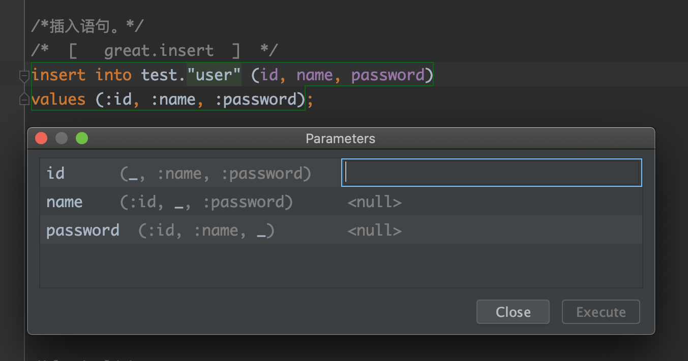
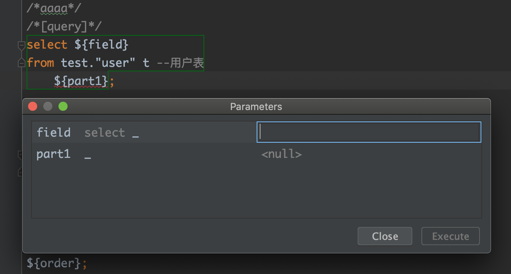

# rabbit-sql 使用说明

这仅仅只是一个小巧的工具，最初想设计为接近**ORM**框架，但放弃了，如果框架无法根据不同的数据库特性生成特有的最有效率的SQL，那么最终都会回到手写sql，其中以下几点说明下：

1. 为了可移植性，如果都是标准SQL，那么就不存在这个问题；
2. 除了手写，即使**ORM**也无法解决复杂sql的拼接；
3. 除了手写，ORM的表关联无法优化。

所以对**JDBC**进行了一个薄封装，提供一些基本的操作，此库以追求简单稳定高效为目标（查询方面以手写sql为主），尽可能减少直接使用反射机制，返回对象类型统一为[`DataRow`](https://github.com/chengyuxing/rabbit-common/blob/master/src/main/java/com/github/chengyuxing/common/DataRow.java)，[`DataRow`](https://github.com/chengyuxing/rabbit-common/blob/master/src/main/java/com/github/chengyuxing/common/DataRow.java)提供了了简单的实体互相转换，此库基本功能如下：

- 基本接口增删改查；
- 简单分页查询；
- 流查询（java8的**Stream**）；
- 预编译sql；
- 调用存储过程/函数；
- 简单的事务；
- 代码与sql文件分离（[SQL文件解析器](#XQLFileManager)）；
- sql文件注释扩展的简单**脚本语法**支持**[动态sql](#XQLFileManager)**；

## maven dependency (jdk1.8)

```xml
<dependency>
    <groupId>com.github.chengyuxing</groupId>
    <artifactId>rabbit-sql</artifactId>
    <version>7.0.6</version>
</dependency>
```

## Spring-Boot支持

**maven dependency (jdk1.8)**

```xml
<dependency>
    <groupId>com.github.chengyuxing</groupId>
    <artifactId>rabbit-sql-spring-boot-starter</artifactId>
    <version>2.0.7</version>
</dependency>
```

具体使用方法和配置可以查看[文档](https://github.com/chengyuxing/rabbit-sql-spring-boot-starter/tree/2.x)。

## [快速上手](#快速上手实例)

## 参数占位符说明

- `:name` (jdbc标准的传名参数写法，参数将被预编译安全处理，参数名为：`name`)

  > 最终编译为`?`，也就是标准的预编译sql。

- `${[:]name}` (通用的字符串模版占位符，不进行预编译，用于动态sql的拼接)

  字符串模版参数名两种格式：

  - `${part}` 如果类型是**装箱类型数组(String[], Integer[]...)**或**集合(Set, List...)**，则先展开（逗号分割），再进行sql片段的替换；
  - `${:part}` 名字前多了前缀符号(`:`)，如果类型是**装箱类型数组(String[], Integer[]...)**或**集合(Set, List...)**，则先展开（逗号分隔），并做一定的字符串安全处理，再进行sql片段的替换。

- 字符串模版中还可以使用传名参数

- 完全参数占位符效果示例：

  sql：

  ```sql
  select ${fields}, ${moreFields} from <tableName> where word in (${:words}) or id = :id;
  ```

  参数：

  ```java
  Args<Object> args = Args.<Object>of("id","uuid")
    .add("fields", "id, name, address")
    .add("moreFields", Arrays.asList("email", "enable"))
    .add("words", Arrays.asList("I'm OK!", "book", "warning"));
  ```
  
  最终执行的SQL：
  
  ```sql
  select id, name, address, email, enable from <tableName> where id in ('I''m Ok!', 'book', 'warning') or id = 'uuid';
  ```

## 接口实现BakiDao

### 构造函数

BakiDao(DataSource dataSource)

### 可选属性

- [**xqlFileManager**](#XQLFileManager)

  接口中需要写sql的所有方法都可以使用``&别名.sql名``取地址符来获取sql文件中的sql。

- **pageHelpers**

  默认为空，内置不满足的情况下，用于注册自定义的分页帮助工具类。

- **debugFullSql**

  默认值: false

  debug模式下打印拼接完整的sql。

- **strictDynamicSqlArg**

  默认值: true

  如果为false，则动态sql的参数可以为null、空或键值不存在，否则将抛出异常。

- **namedParamPrefix**

  默认值为冒号 `:`，全局预编译sql传名参数前缀，同样生效于[SQL文件解析器](#XQLFileManager)，例如 `...where id = :id`，如果设置为 `?` 则sql可写为 `where id = ?id`。

- **checkParameterType**

  默认值: true

  如果为true，则检查预编译参数对应数据库映射出来的真实java类型，可实现参数智能匹配合适的类型；

  例如：PostgreSQL中，字段类型为`jsonb`，参数为一个`HashMap<>()`，则将对参数进行json序列化并插入；

  ⚠️ 由于jdbc驱动实现问题，此特性暂不支持Oracle和某些数据库，如果发生异常，请将此属性设置为false。
  

## XQLFileManager

:bulb: 为什么不叫 `SQLFileManager`？并不是写错了，而是对普通sql文件的标准进行了扩展，不破坏标准的前提下通过特殊格式化的注释进行了扩展支持脚本进行逻辑判断，得以支持**动态sql**，所以是更加强大的SQL文件解析器。

文件结尾以`.sql`或`.xql`结尾，文件中可以包含任意符合标准的注释，格式参考```data.xql.template```；

对象名格式为``/*[name]*/``，sql文件中可以嵌套sql片段，使用`${片段名}`指定;

片段名格式化``/*{name}*/``，sql片段中可以嵌套sql片段，使用`${片段名}`指定。

IOC容器配置例子，这里使用**Nutz**框架的ioc容器，其他框架同理：

```javascript
xqlFileManager: {
        type: 'com.github.chengyuxing.sql.XQLFileManager',
        fields: {
            constants: {
                db: "test"
            },
            files: {
                sys: 'pgsql/test.sql',
                mac: 'file:/Users/chengyuxing/Downloads/local.sql'
            }
        }, events: {
            create: 'init'
        }
    }
```

**springboot** 配置例子：

`application.yml`

```yaml
xql:
  files:
    home: xql/home.sql
    index: xql/index.sql
  constants:
    db: qbpt_deve
    db2: mysql
```

`RabbitConfig.java`

```java
@Bean(initMethod = "init")
@ConfigurationProperties(prefix = "xql")
public XQLFileManager xqlFileManager() {
  return new XQLFileManager();
}
```

#### 构造函数

- XQLFileManager()

- XQLFileManager(Map<String, String> files)


#### 属性

- **checkModified**

  如果为`true`，则开启sql文件修改监听器，默认30秒检测一次，如果修改过则重新加载，生产环境建议设置为`false`。

- **checkPeriod**

  sql文件修改监听检查周期，默认为30秒。

- **charset**

  设置解析SQL文件使用的编码，默认**UTF-8**。

- **namedParamPrefix**

  默认值为冒号 `:`，预编译sql传名参数前缀，例如 `...where id = :id`，如果设置为 `?` 则sql可写为 `where id = ?id`。

- **delimiter**

  解析文件时的SQL块分隔符。

  每个文件的sql片段块解析分隔符，每一段完整的sql根据此设置来进行区分，**默认是单个分号（;）**遵循标准sql文件多段sql分隔符，但是有一种情况，如果sql文件内有psql：**create function...** 或 **create procedure...**等， 内部会包含多段sql多个分号，为防止解析异常，单独设置自定义的分隔符:

  - 例如（`;;`）双分号，也是标准sql所支持的, **并且支持仅扫描已命名的sql**；
  - 也可以设置为`null`或`空白`，那么整个SQL文件多段SQL都应按照此方式分隔。

- **constants**

  全局SQL字符串模版常量

  sql文件将优先寻找sql文件内的sql片段，没找到的情况下，如果配置了属性```constants```，则再从```constants```常量集合中查找；

  BakiDao中执行sql方法参数中如果没有找到sql字符串模版，则自动查找并替换`constants`中的常量，例如：

  ```java
  baki.update("${db}.user",...);
  // --> update test.user ...
  ```

- **files** 

  命名别名的文件路径集合字典

  取sql写法，**文件别名.sql名**：`sys.getUser`
  
- **pipes**

  自定义管道字典集合，**key**为管道名，**value**为管道类名，**用于动态sql脚本的参数值**，例如：

  ```sql
  -- 传入的name参数经过名为length的管道输出长度和3进行大小比较
  :name|length <= 3
  ```

  :bulb: 管道顾名思义，可以链式使用 `:id | upper | is_id_card | ...`

- **pipeInstances**

  自定义管道实例的字典集合，和**pipes**字段一样，最终都将合并一同解析装载。

#### 动态SQL

- 支持`--#if`和`--#fi`块标签，必须成对出现，类似于Mybatis的`if`标签，支持嵌套if，choose，switch：

  ```sql
  --#if 表达式1
         --#if 表达式2
         ...
         --#fi
  --#fi
  ```

- 支持`--#switch`和`--#end`块标签，内部为：`--#case`, `--#default`和`--#break`，效果类似于程序代码的`switch`，分支中还可以嵌套if语句:

  ```sql
  --#switch :变量
         --#case 值1
         ...
         --#break
         --#case 值2
         ...
         --#break
         ...
         --#default
         ...
         --#break
  --#end
  ```

- 支持`--#choose`和`--#end`块标签，内部为`--#when`, `--#default`和`--#break`，效果类似于mybatis的`choose...when`标签，分支中还可以嵌套if语句：

  ```sql
  --#choose
         --#when 表达式1
         ...
         --#break
         --#when 表达式2
         ...
         --#break
         ...
         --#default
         ...
         --#break
  --#end
  ```

- 支持`--#for`循环标签，**内部不能嵌套其他任何标签，不进行解析**，但可以嵌套在`--#if`标签中，类似于程序的`foreach`，并进行了一些扩展：

  ```sql
  --#for 表达式
  ...
  --#end
  ```

  表达式语法：

  ```bash
  item[,idx] of :list [| pipe1 | pipe2 | ... ] [delimiter ','] [filter ${item.name}[| pipe1 | pipe2 | ... ] <> blank]
  ```

  :bulb: 关于for表达式的说明：

  - 关键字：... **of** ... **delimiter** ... **filter** ...；

  - **[]**内表示为可选参数；

  - `item`表示迭代对象的当前值，`idx`表示当前索引，可以随意命名，但不能一样；

  - 如果没有指定`delimiter`分割符，则默认迭代的sql使用逗号`,`连接；

  - 如果指定`filter`过滤器，则对迭代对象进行筛选匹配值影响最终生成的sql；

    `filter`的表达式语法和标准的有些不同，因为**被比较值**来自于for循环，不能使用`:参数名`，所以只能使用`${for定义的参数名}`来表示。

- 支持的运算符：

  | 运算符 | 说明           |
  | ------ | -------------- |
  | <      | 大于           |
  | >      | 小于           |
  | >=     | 大于等于       |
  | <=     | 小于等于       |
  | ==, =  | 等于           |
  | !=, <> | 不等于         |
  | ~      | 正则表查找包含 |
  | !~     | 正则查找不包含 |
  | @      | 正则匹配       |
  | !@     | 正则不匹配     |

- 支持的逻辑符：`||`, `&&`, `!`

- 支持嵌套括号：`(`, `)`

- 内置常量：`null` , `blank`(null、空白字符、空数组、空集合) , `true` , `false`

**表达式语法例子如下：**

```java
!(:id >= 0 || :name <> blank) && :age <= 21
```

**动态SQL具体语法例子如下：**

```sql
select *
from test.region t
where t.enable = true
--#if :a <> blank
      and t.a = :a
      --#if :a1 <> blank && :a1 = 90
        and t.a1 = :a1
      --#fi
      --#if :a2 <> blank
        and t.a2 = :a2
          --#choose
              --#when :xx <> blank
                and t.xx = :xx
              --#break
              --#when :yy <> blank
                and t.yy = :yy
              --#break
              --#default
                and t.zz = :zz
              --#break
          --#end
      --#fi
--#fi
--#switch :name
      --#case blank
        and t.name = 'blank'
      --#break
      --#case 'chengyuxing'
        and t.name = 'chengyuxing'
      --#break
      --#default
        and t.name = 'unset'
      --#break
--#end
--#if :b <> blank
    and t.b = :b
--#fi
and x = :x
;
```

**for的例子如下**：

`a.sql`

```sql
select * from test.user t where
--#if :names <> blank
    --#for u,i of :users delimiter ' and ' filter ${i} > 0 && ${u.name} ~ 'a'
    t.name = ${:name}
    --#end
--#fi
;
```

`test.java`

```java
List<Map<String, Object>> users = Arrays.asList(
  Args.of("name", "cyxa"), 
  Args.of("name", "jack"), 
  Args.of("name", "lisa"), 
  Args.of("name", "lion")
);
Args<Object> args = Args.create("users", users, "names", names, "id", 10);
System.out.println(sqlFileManager.get("for.q", args));
```

`输出`

```sql
select * from test.user t where
t.name = 'jack' and t.name = 'lisa';
```

⚠️ **case**和**when**分支中可以嵌套**if**语句，但不可以嵌套**choose**和**switch**，**if**语句中可以嵌套**choose**、**switch**和**for**，以此类推，理论上可以无限嵌套，但过于复杂，不太推荐，**3层以内**较为合理。

## 对 *IntelliJ IDEA* 的友好支持

- 配置了数据源的情况下，可以直接选中需要执行的sql右键，点击`Execute`执行sql，参数占位符(`:name`)和sql片段占位符(`${part}`)都会弹出输入框方便填写，直接进行测试sql
  
  
  


## 快速上手实例

这仅仅就是一个普通的基本CRUD操作接口，至于其他方面，**完全取决于个人的编程习惯**，写的是否优美，是否合理、清晰、整洁，此库都无从约束，和此库关系不大。

### 初始化

```java
dataSource=new HikariDataSource();
...
XQLFileManager manager=new XQLFileManager(...);
BakiDao baki=new BakiDao(dataSource);
baki.setXqlFileManager(manager);
```

### 查询

查询一般使用baki提供的`query`方法，`query` 返回一个**查询执行器**，提供了一些常用的结果返回类型，例如：`stream`，`list` 等。

#### 流查询

```java
try(Stream<DataRow> fruits=baki.query("select * from fruit").stream()){
        fruits.limit(10).forEach(System.out::println);
        }
```

#### 分页查询

```java
PagedResource<DataRow> resource = baki.query("select * from test.region where id < :id")
                .arg("id", 8)
                .<DataRow>pageable(1, 7)
                .count(5)
                .collect(d -> d);
```

#### 自定义分页查询

`/pgsql/data.sql`

```sql
/*[custom_paged]*/
select * from test.region
where id > :id limit :limit offset :offset;
```

```java
PagedResource<DataRow> res = baki.query("&pgsql.data.custom_paged")
  							.<DataRow>pageable(1, 7)
                .count("select count(*) from <table> where id > :id")
                .args(Args.create("id", 8))
                .disableDefaultPageSql() //禁用默认生成的分页sql
                .collect(d -> d);
```

### 更新&插入

更新一般使用baki提供的`update`方法，`update` 返回一个**更新/插入执行器**，具体说下几个细节：

- **safe**属性：在插入数据之前先获取要插入表的所有字段，并将要插入数据中的不存在的表字段的数据过滤，最终生成的update语句只包含表中存在的字段；

  > 需要注意，如果100%确定自己要插入的数据无误，可以不调用次属性，以提高性能；

- **fast**属性：底层调用的是jdbc的批量执行，不是预编译sql，所以其中一个需要注意的地方就是**不能插入二进制文件**。

  > 一般情况不推荐使用，除非真的需要一次性插入上千条数据批量操作。

- update方法第二个参数`where`，如果不包含参数占位符，那么条件都是固定的，所有数据都将根据一个固定的条件执行更新，如果是包含参数占位符，例如： `id = :id`，那么需要更新的数据中必须包含 `id` 参数值，每条数据将动态的根据此id进行更新。

  例如数据为：`{name: 'cyx', 'age': 29, id: 13}`，条件：`id = :id`，update方法最终会自动识别出where中的参数，并构建合理的sql语句：

  ```sql
  update <table> set name = :name, age = :age where id = :id;
  ```

### 事务

事务设计为与线程绑定，使用请遵循事物的线程隔离性。

```java
Tx.using(()->{
  baki.update(...)...;
  baki.delete(...);
  baki.insert(...)...;
  ......
});
```

### 存储过程

```java
Tx.using(()->baki.call("{call test.fun_query(:c::refcursor)}",
        Args.of("c",Param.IN_OUT("result",OUTParamType.REF_CURSOR)))
        .<List<DataRow>>getFirstAs()
        .stream()
        .map(DataRow::toJson)
        .forEach(System.out::println));
```
