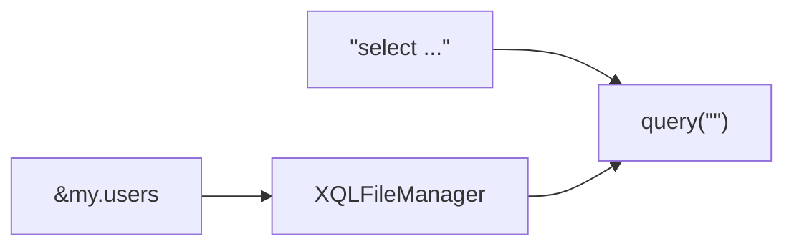

# rabbit-sql

[![License][badge:license]][license]
[![Maven][badge:maven]][maven-repository]
[![Version][badge:version]][versions]

Language: English | [简体中文](README.chs.md)

You don't like sql in xml, don't like xml binding to interfaces?

You don't like tools auto generate too many entities and interfaces file?

You don't like writing [dynamic sql](#Dynamic-sql) in java code?

## Introducing

It's just a small lib, wrapper of **jdbc**, support some basic operation. simple, stable and efficient as the goal(query operation accept sql statement mainly), some features following:

- Basic operation for insert, delete, update, query;
- simple [pageable query](#Paging);
- [stream query](#Stream-query)(java8 **Stream**);
- [execute procedure/function](#Procedure);
- simple [transaction](#Transaction);
- [prepare sql](#Prepare-SQL);
- [sql in file](#XQLFileManager);
- [sql fragment reuse](#XQLFileManager);
- [dynamic sql](#Dynamic-SQL);
- support **spring-boot** framework.

## Maven dependency (jdk1.8)

Maven central

```xml
<dependency>
    <groupId>com.github.chengyuxing</groupId>
    <artifactId>rabbit-sql</artifactId>
    <version>7.6.4</version>
</dependency>
```

## Spring-Boot(2.7+) support

- support rabbit-sql autoconfigure；
- support `application.yml` auto complete；
- compatible with spring jdbc transaction；
- compatible mybatis、spring-data-jpaand so on to use transaction together；

Get some usage from [document](https://github.com/chengyuxing/rabbit-sql-spring-boot-starter).

## IDEA-plugin-support

Plugin marketplace: [Rabbit sql](https://plugins.jetbrains.com/plugin/21403-rabbit-sql) and [documentation](https://github.com/chengyuxing/rabbit-sql-plugin#readme).

## Quick start

### Init

```java
dataSource=new HikariDataSource();
...
BakiDao baki=new BakiDao(dataSource);
```

### Query

Use [baki](#BakiDao)'s  `query` operation，`query` returns a **query executor**，support some return type like：`Stream`，`Optional` and so on.

```java
baki.query("select … where id = :id").arg("id", "1")
```

```java
baki.query("&my.users")
```



> Except accept sql statement, also support accept sql by name, name start with `&` to get sql from [sql file manager](#XQLFileManager).

#### Example

##### Stream-query

```java
try(Stream<DataRow> fruits=baki.query("select * from fruit").stream()){
        fruits.limit(10).forEach(System.out::println);
        }
```

> Query will not truly execute until invoke **Stream terminal operation**(e.g `foreach()` ), use jdk7 **try-with-resource** to release connection when query complete.

##### Paging

Default pageable query will auto generate **paging statement** and **count** statement by database.

Built-in support oracle, mysql, postgresql, sqlite, mariadb, db2, or extends class `com.github.chengyuxing.sql.page.PageHelperProvider` and set to [BakiDao](#BakiDao) get support.

```java
PagedResource<DataRow> resource = baki.query("select ... where id < :id")
                .arg("id", 8)
                .pageable(1, 7)
                .collect();
```

##### Custom paging

`/pgsql/data.sql`

```sql
/*[custom_paged]*/
with t as (
  select * from test.region
  where id > :id limit :limit offset :offset
)
select * from t;
;
```

```java
PagedResource<DataRow> res = baki.query("&data.custom_paged")
  		          .pageable(1, 7)
                .count("select count(*) ... where id > :id")
                .disableDefaultPageSql()
                .collect();
```

> `disableDefaultPageSql()` will not wrap sql to generate paging statement of name custom_paged.
>
> **count** statement is required now.

##### Procedure

```java
baki.of("{call test.fun_query(:c::refcursor)}")
        .call(Args.of("c", Param.IN_OUT("result",OUTParamType.REF_CURSOR)))
        .<List<DataRow>>getFirstAs()
        .stream()
        .forEach(System.out::println);
```

> If **postgresql**, you must use transaction when returns cursor.

### Update & Insert

I'm going to focus here on the update operation, use [baki](#BakiDao)'s  `update` operation, `update` returns a **update executor**，some details following:

- **safe** property: get all table fields before execute update, and remove updated data fields which not exist in table fields;

  > Notice, recommend do not use this property for improve performance if you 100% fully know the data you need will be updated.
  >
  > Same as **insert** operation.

- **fast** property: in fact, is invoke jdbc batch execute, it's not prepared sql, so not support blob file.

  > It's not  recommend unless you need to batch execute more than 1000 rows of data.
  >
  > Same as **insert** operation.

The 2nd arg `where` of `update` operation, condition is static if statement not contains named parameter, all data will be updated on static condition; if statement contains named parameter like: `id = :id` , all data will be updated dynamically by every id parameter value.

##### Example

Data:`[{name: 'cyx', 'age': 29, id: 13}, ...]`;

Condition: `id = :id`;

`update` operation can find arg which in condition and generate correct update statement:

```sql
update ... set name = :name, age = :age where id = :id;
```

### Transaction

Use of transactions follows thread isolation:

```java
Tx.using(() -> {
  baki.update(...);
  baki.delete(...);
  baki.insert(...);
  ......
});
```

## SQL parameter holder

### Prepare-SQL

Prepare sql support named parameter style, e.g: 

`:name` (jdbc standard named parameter syntax, sql will be prepare saftly, parameter name is `name` )

> Named parameter will be compile to `?`, Recommend to use prepare sql for avoid sql injection.

### String template

`${[!]name}` (string template holder, not prepare, use for sql fragment reuse)

2 styles：

- `${name}`: if value type is **boxed type array(String[], Integer[]...)** or **collection (Set, List...)**, just expand value and replace.
- `${!name}`: name start with `!`, if value type is **boxed type array(String[], Integer[]...)** or **collection(Set, List...)**, expand value and safe quote, then replace.

#### Example

sql:

```sql
select ${fields}, ${moreFields} from ... where word in (${!words}) or id = :id;
```

args:

```java
Args.<Object>of("id","uuid")
  .add("fields", "id, name, address")
  .add("moreFields", Arrays.asList("email", "enable"))
  .add("words", Arrays.asList("I'm OK!", "book", "warning"));
```

generate sql:

```sql
select id, name, address, email, enable from ... where id in ('I''m Ok!', 'book', 'warning') or id = ?;
```

## Dynamic-SQL

Dynamic SQL depends on [XQLFileManager](#XQLFileManager), based on resolve special annotation mark, dynamic compile without breaking sql file standards.

### Annotation mark

Annotation mark must be pair and follows **open-close** tag.

#### if

Similar to Mybatis's  `if`  tag:

```sql
--#if :user <> null
       --#if :user.name <> blank
       ...
       --#fi
--#fi
```

#### switch

Similar to program language `switch`'s logic:

```sql
--#switch :name
       --#case 'jack'
		...
       --#break
       ...
       --#default
       	...
       --#break
--#end
```

#### choose

Similar to Mybatis's `choose...when` tag:

```sql
--#choose
       --#when :id >= 0
       ...
       --#break
       ...
       --#default
       	...
       --#break
--#end
```

#### for

Similar to Mybatis's `foreach`, and more features:

```sql
--#for item,idx of :list delimiter ',' open '' close ''
	...
--#end
```

**For expression** syntax:

:warning: `filter` keyword removed from this version, not support anymore.

Keywords: `of` `delimiter` `open` `close`

```sql
item[,index] of :list [|pipe1|pipeN|... ] [delimiter ','] [open ''] [close '']
```

- `[...]` means optional;
- `item` is current value, `index` is current index;
- `:list` is iterator, it can be following some [pipes](#Pipe) to do something special;
- `delimiter` is a separator for concat each item,  `,` is default;
- `open` is a prefix which will pe prepend to result if result is not empty;
- `close` is a suffix which will be append to result if result is not empty.

### Expression-script

Data's key is starts with `:`.

 A simple expression syntax following: 

```sql
!(:id >= 0 || :name | length <= 3) && :age > 21
```

#### Supported operator

| Operator | Means               |
| -------- | ------------------- |
| <        | less than           |
| >        | great than          |
| >=       | great than or equal |
| <=       | less than or equal  |
| ==, =    | equal               |
| !=, <>   | not equal           |
| ~        | regex find          |
| !~       | regex not find      |
| @        | regex match         |
| !@       | regex not match     |

- Support logic symbol: `||`, `&&`, `!` ;

- Support nest bracket: `(`, `)` ;

- Support data type: string(`""`、`''`), number(12、3.14), boolean(`true` , `false`);

- Built-in constants: `null` , `blank` (`null`, empty string、empty array、empty collection);

> use custom **pipe** to implement more features.

#### Pipe

Syntax look like `:id | upper | is_id_card | ...` e.g: 


```sql
-- get value by name through length pipe and compare with number 3
:name|length <= 3
```

Implement  `com.github.chengyuxing.common.script.IPipe`  interface and add to [XQLFileManager](#XQLFileManager)  to use pipe.

**Built-In pipes:**

- **length**: get length of string value;
- **upper**: convert to upper case;
- **lower**: convert to lower case;
- **pairs**: map convert to pairs `List<Pair>`.

### Example

Here is about dynamic generate **named parameter sql**,  **named parameter** will be     prepare compile to `?`  to keep safe.

:warning: Prefix  **_for.** in `for` body is an identity to **generate named parameter unique index automatically**, for generate correct named parameter.

**for** is useful at sql `in` statement, it can be build prepared sql:

```sql
/*[query]*/
select * from test.user where id = 1
-- #for id of :ids delimiter ', ' open ' or id in (' close ')'
    -- #if :id >= 8
    :_for.id
    -- #fi
-- #done
```

To maintain sql syntax integrity, highlighting syntax errors does not occur in ides with syntax checking, and the following equivalent writing is recommended:

```sql
select * from test.user where id = 1
-- #if :ids != blank
or id in (
    -- #for id of :ids delimiter ', '
        -- #if :id >= 8
        :_for.id
        -- #fi
    -- #done
    )
-- #fi
;
```

```json
{"ids": [1, 2, 3, 4, 5, 6, 7, 8, 9, 10, 11, 12]}
```

example above will be generate sql and variables:

```sql
select * from test.user where id = 1
 or id in (
    :_for.id_0_7, 
    :_for.id_0_8, 
    :_for.id_0_9, 
    :_for.id_0_10, 
    :_for.id_0_11
)
```

```json
{
  "_for": {
    "id_0_0": 1,
    "id_0_2": 3,
    "id_0_1": 2,
    "id_0_10": 11,
    "id_0_11": 12,
    "id_0_4": 5,
    "id_0_3": 4,
    "id_0_6": 7,
    "id_0_5": 6,
    "id_0_8": 9,
    "id_0_7": 8,
    "id_0_9": 10
  }
}
```

For a few special places to explain:

- If for loop result is not empty, `open` means `or id in(` will prepend to result, `close` means `)` will append to result;
- Variable starts with `:` in sql means it's a named parameter which will prepare compile;
- Prefix `_for.` is special variable name in for loop body, it's necessary to follow the rule when use for-variable for named parameter, for auto generate named parameter with unique index correctly.

**for** work with `update` statement sets part:

```sql
/*[update]*/
update test.user
set
-- #for set of :sets | kv delimiter ', '
    ${set.key} = :_for.set.value
-- #done
where id = :id;
```

```json
{
  "id": 10,
  "data": {
    "name": "abc",
    "age": 30,
    "address": "kunming"
  }
}
```

example above will generate sql and variables:

```sql
update test.user
set
  address = :_for.set_0_0.value,
  name = :_for.set_0_1.value,
  age = :_for.set_0_2.value
where id = :id
```

```json
{
  "id": 10,
  "_for": {
    "set_0_2": {
      "key": "age",
      "value": 30
    },
    "set_0_1": {
      "key": "name",
      "value": "abc"
    },
    "set_0_0": {
      "key": "address",
      "value": "kunming"
    }
  }
}
```

Explain:

- `:data` is a map, it convert to pairs `List<pair>` by pipe `pairs`, so it can be work with for expression;
- `${pair.item1}` is string template holder, it's formatting on each loop, so prefix `_for.` is not required.

Concat different sql statement by database name:

```sql
/*[query]*/
select * from test.user
where id = 3
-- #if :_databaseId == 'postgresql'
    ...
-- #fi
-- #if :_databaseId == 'oracle'
    ...
-- #fi
;
```

- Built-In variable `_databaseId` is current database name.

## Appendix

A little important details you need to know.

### BakiDao

Default implement of interface **Baki**, support some basic operation.

- If [XQLFileManager](#XQLFileManager) configured ,  you can manage sql in file and support [dynamic sql](#Dynamic-SQL);

- Default named parameter start with `:` , it can be customized by specific property `namedParamPrefix`, e.g:

  ```sql
  where id = ?id
  ```

- if [pageable query](#paging) not support your database, implement custom page helper provider to property `globalPageHelperProvider` get support.

### XQLFileManager

SQL file manager extends standard sql annotation implement more features, for support [dynamic sql](#Dynamic-SQL) and expression scripts logic judgment without breaking standard sql structure, also it's more powerful SQL file resolver.

you can get sql syntax highlight, intelligent suggestions and error check when using sql develop tools cause support sql file with extension `.sql`, dba developer     work with java developer together so easy.

Supported file extension with `.sql` or `.xql`, you can write any standard sql annotation in file, format reference `data.xql.template`.

:bulb: Recommend use `.xql` file to get [plugin](#IDEA-plugin-support) supports.

Every managed sql file must follows **"k-v"** structure, e.g:

`my.sql`

```sql
/*[query]*/
select * from test."user" t ${part1};

/*part 1*/
/*{part1}*/
where id = :id
${order};

/*{order}*/
order by id;

...
```

- Sql object name formatter is `/*[name]*/`, sql object supports nest sql fragment by using `${fragment name}` holder; 

- Sql fragment name formatter is `/*{name}*/` , sql fragment supports nest sql fragment by using `${fragment name}` holder to reuse, as above example `my.sql`:

  ```sql
  select * from test."user" t where id = :id order by id;
  ```

#### Constructor

- **new XQLFileManager()**

  If source root `.../src/main/resources` contains file what is named `xql-file-manager.properties` or `xql-file-manager.yml`, optional properties will be init by this file, if both exists, `xql-file-manager.yml` go first,

  Default options:
  
  `xql-file-manager.yml`
  
  `!path` tag use for merge list to path string.
  
  ```yaml
  constants:
  #  base: &basePath pgsql
  
  files:
  # use !path tag merge list to "pgsql/other.xql"
  #  dt: !path [ *basePath, other.xql ]
  #  other: another.xql
  
  pipes:
  #  upper: org.example.Upper
  
  delimiter: ;
  charset: UTF-8
  # for plugin
  named-param-prefix: ':'
  ```
  
   `sql-file-manager.properties` 
  
  ```properties
  # Format: multi xql file configure the custom alias, e.g:
  files.dt=data.sql
  files.sys=system.sql
  
  pipes.upper=org.example.Upper
  
  constants=
  
  # Multi sql fragment delimiter symbol in xql file, ';' is the default also standard.
  # Notice: if your sql fragment is ddl or procedure, maybe one fragment contains
  # more ';' and it's not a delimiter, you have to change delimiter to another like ';;'.
  delimiter=;
  
  # UTF-8 is the default.
  charset=UTF-8
  # for plugin
  namedParamPrefix=:
  ```

#### Options

- **files**

  Sql file mapping dictionary, key is alias, value is sql file name, you can get sql statement  by `alias.your_sql_name` when sql file added, as above example: `my.sql`;

- **pipeInstances/pipes**

  Custom [pipe](#Pipe) dictionary, **key** is pipe name, **value** is pipe class, for dynamic sql expression's value, get more [dynamic sql expression](#Expression-script)'s features by implement custom pipe;

- **delimiter**

  Sql file **"k-v"** structure delimiter **default `;`**, follows standard multi sql structure delimiter by `;`, but there is a condition, if you have plsql in file e.g: `create function...` or `create procedure...`, it will be multi sql statement in one sql object, you need specific custom delimiter for resolve correctly:

  - e.g ( `;;`) double semicolon.


[badge:maven]:https://img.shields.io/maven-central/v/com.github.chengyuxing/rabbit-sql
[badge:license]: https://img.shields.io/github/license/chengyuxing/rabbit-sql

[badge:version]:https://img.shields.io/jetbrains/plugin/v/21403
[license]:https://github.com/chengyuxing/rabbit-sql/blob/main/LICENSE
[maven-repository]:https://central.sonatype.com/artifact/com.github.chengyuxing/rabbit-sql
[versions]:https://plugins.jetbrains.com/plugin/21403-rabbit-sql/versions
