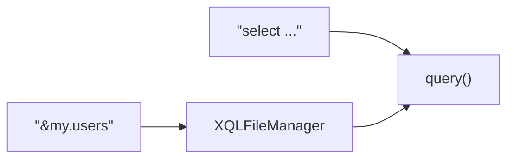
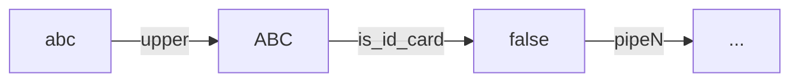

# rabbit-sql

[![License][badge:license]][license]
[![Maven][badge:maven]][maven-repository]
[![Version][badge:version]][versions]

<a href="https://rabbitsql.cn" target="_blank"></a>

Language: English | [简体中文](https://github.com/chengyuxing/rabbit-sql/blob/master/README.chs.md)

## Introducing

Get [Best practice](https://github.com/chengyuxing/rabbit-sql/blob/master/BEST_PRACTICE.md) or [demo](https://github.com/chengyuxing/rabbit-sql-quickstart) to quick start.

This is a lightweight persistence layer framework, provides a complete database operation solution, through encapsulation and abstraction, simplifies the complexity of database access, but also provides flexibility and scalability for developers. simple, stable and efficient as the goal, some features following:

- [execute procedure/function](#Procedure)
- simple [transaction](#Transaction)
- [prepare sql](#Prepare-SQL)
- [sql in file](#XQLFileManager)
- [dynamic sql](#Dynamic-SQL)
- [interface mapping](#Interface-Mapping)
- [entity mapping](Entity-Mapping)

## Maven dependency

_java 8+_

```xml
<dependency>
  <groupId>com.github.chengyuxing</groupId>
  <artifactId>rabbit-sql</artifactId>
  <version>10.2.5</version>
</dependency>
```

## Spring-Boot(2.7+) support

- support rabbit-sql autoconfigure；
- compatible with spring jdbc transaction；
- compatible mybatis、spring-data-jpaand so on to use transaction together；


Get some usage from [document](https://github.com/chengyuxing/rabbit-sql-spring-boot-starter).

## IDEA-plugin-support

Dynamic sql test:


Xql interface mapper generate:

Plugin marketplace: [Rabbit sql](https://plugins.jetbrains.com/plugin/21403-rabbit-sql) and [documentation](https://github.com/chengyuxing/rabbit-sql-plugin#readme).

## Quick start

There are two ways, Baki interface oriented and xql mapping interface oriented, that are compatible with each other.

### Init

```java
Datasource datasource = new HikariDataSource();
...
BakiDao baki = new BakiDao(dataSource);

XQLFileManager xqlFileManager = new XQLFileManager("xql-file-manager.yml");
...
baki.setXqlFileManager(xqlFileManager);
```

### Interface-Mapping

Supports registered **xql** file mapping(`BakiDao#proxyXQLMapper`) to interface which annotated with `@XQLMapper`, do some sql operation by invoke dynamic proxy method.

```java
ExampleMapper mapper = baki.proxyXQLMapper(ExampleMapper.class)
```

If Springboot is used, the annotation `@XQLMapperScan` can be directly added to the boot class to automatically register it in the context through the interface scanning mechanism, and then the interface can be injected Specific can consult [document](https://github.com/chengyuxing/rabbit-sql-spring-boot-starter) .

`example.xql`

```sql
/*[queryGuests]*/
select * from test.guest where id = :id;

/*[addGuest]*/
insert into test.guest(name, address, age)values (:name, :address, :age);
```

`ExampleMapper.java`

```java
@XQLMapper("example")
public interface ExampleMapper {
  List<DataRow> queryGuests(Map<String, Object> args);
  
  @XQL(value = "queryGuests")
  Optional<Guest> findById(@Arg("id") int id);
  
  @XQL(type = SqlStatementType.insert)
  int addGuest(DataRow dataRow);
}
```

By default, all methods behaviors are depends on method prefix and sql name mapping to method name if matched, otherwise use `@XQL(value = "sql name",type = SqlStatementType.insert)` annotate method to specify the sql name and modify the default query behave, methods must follow the rules:

| Sql type             | Method prefix                                              |
| -------------------- | ---------------------------------------------------------- |
| select               | select \| query \| find \| get \| fetch \| search \|create |
| insert               | insert \| save \| add \| append \|create                   |
| update               | update \| modify \| change                                 |
| delete               | delete \| remove                                           |
| procedure / function | call \| proc \| func                                       |

**Argument type:**

- **Argument dictionary**: `DataRow|Map<String,Object>|<JavaBean>`
- **Argument List**: Each argument annotated with `@Arg`

| Return Type                                            | sql Type（Type）                              | Remark                  |
| ------------------------------------------------------ | --------------------------------------------- | ----------------------- |
| `List<DataRow/Map<String,Object>/<JavaBean>>`          | query                                         |                         |
| `Set<DataRow/Map<String,Object>/<JavaBean>>`           | query                                         |                         |
| `Stream<DataRow/Map<String,Object>/<JavaBean>>`        | query                                         |                         |
| `Optional<DataRow/Map<String,Object>/<JavaBean>>`      | query                                         |                         |
| `Map<String,Object>`                                   | query                                         |                         |
| `PagedResource<DataRow/Map<String,Object>/<JavaBean>>` | query                                         | `@CountQuery`(optional) |
| `IPageable`                                            | query                                         | `@CountQuery`(optional) |
| `Long`, `Integer`, `Double`                            | query                                         |                         |
| `<JavaBean>`                                           | query                                         |                         |
| `DataRow`                                              | query, procedure, function, ddl, plsql, unset |                         |
| `int/Integer`                                          | insert, update, delete                        |                         |

If the method annotated with special annotations, method will not mapping to xql file sql name, it just execute by the itself:

- `@Procedure`
- `@Function`

### Baki

Basic interface to access database.

#### Query

```java
baki.query("select … where id = :id").arg("id", "1")
```

```java
baki.query("&my.users")
```



> Except accept sql statement, also support accept sql by name, name start with `&` to get sql from [sql file manager](#XQLFileManager).

**Example**

- Stream-query

```java
try(Stream<DataRow> fruits = baki.query("select * from fruit").stream()){
        fruits.forEach(System.out::println);
        }
```

> Query will not truly execute until invoke **Stream terminal operation**(e.g. `foreach()` ), use jdk7 **try-with-resource** to release connection when query complete.

- Paging

Default pageable query will auto generate **paging statement** and **count** statement by database.

Built-in support oracle, mysql, postgresql, sqlite, mariadb, db2, or extends class `com.github.chengyuxing.sql.plugins.PageHelperProvider` and set to [BakiDao](#BakiDao) get support.

```java
PagedResource<DataRow> resource = baki.query("select ... where id < :id")
                .arg("id", 8)
                .pageable(1, 7)
                .collect();
```

- Custom paging

`/pgsql/data.sql`

```sql
/*[custom_paged]*/
with t as (
  select * from test.region
  where id > :id limit :limit offset :offset
)
select * from t;
;
```

```java
PagedResource<DataRow> res = baki.query("&data.custom_paged")
  		          .pageable(1, 7)
                .count("select count(*) ... where id > :id")
                .disableDefaultPageSql()
                .collect();
```

> `disableDefaultPageSql()` will not wrap sql to generate paging statement of name custom_paged.
>
> **count** statement is required now.

#### Procedure

```java
baki.call("{:res = call test.sum(:a, :b)}",
      Args.of("res", Param.OUT(StandardOutParamType.INTEGER))
              .add("a", Param.IN(34))
              .add("b", Param.IN(56))
      ).getOptional("res")
      .ifPresent(System.out::println);
```

> If **postgresql**, you must use transaction when returns cursor.

### Entity-Mapping

To achieve the purest execution of SQL in this framework, the entity mapping logic will no longer be hard-coded internally to reach the maximum compatibility with various frameworks. The core of entity mapping is the `DataRow` class, which provides the methods` toEntity` and `ofEntity`. If there are special entity mapping requirements, Custom parsing can be achieved by configuring the attribute `BakiDao#entityMetaProvider`. 

```java
public class JpaEntityMetaParser implements EntityManager.EntityMetaProvider {
  ...
}
```

In other frameworks, even custom field annotation parsing can meet the requirements and is no longer limited by the entity mapping rules of other frameworks.

### Transaction

Use of transactions follows thread isolation:

```java
Tx.using(() -> {
  ......
});
```

## SQL parameter holder

### Prepare-SQL

Prepare sql support named parameter style, e.g. 

`:name` (jdbc standard named parameter syntax, sql will be prepare saftly, parameter name is `name` )

> Named parameter will be compile to `?`, Recommend to use prepare sql for avoid sql injection.

### String template

`${[!]name}` (string template holder, not prepare, use for sql fragment reuse)

2 styles：

- `${name}`: if value type is **boxed type array(String[], Integer[]...)** or **collection (Set, List...)**, just expand value and replace.
- `${!name}`: name start with `!`, if value type is **boxed type array(String[], Integer[]...)** or **collection(Set, List...)**, expand value and safe quote, then replace.

#### Example

sql:

```sql
select ${fields} from ... where word in (${!words}) or id = :id;
```

args:

```java
Args.<Object>of("id","uuid")
  .add("fields", Arrays.asList("name", "age"))
  .add("words", Arrays.asList("I'm OK!", "book", "warning"));
```

generate sql:

```sql
select name, age from ... where id in ('I''m Ok!', 'book', 'warning') or id = ?;
```

## Dynamic-SQL

Dynamic SQL depends on [XQLFileManager](#XQLFileManager), based on resolve special comment mark, dynamic compile without breaking sql file standards.

### Comment mark

Comment mark must be pair and follows **open-close** tag.

It should be particularly noted that if a value type string literal is not a pure number or keyword (`null`, `blank`, `true`, `false`), it does not need to be enclosed in quotation marks and defaults to a string. For example, in `:name = bob`, the quotation mark for `'bob'` is not necessary.

#### check

The precondition check statement throws an exception message (`CheckViolationException`) if the condition is met.

Before the database actually executes the sql, conduct a validity verification of the parameters to avoid parameter type error anomalies at the database level and save resources.

```sql
-- #check :id > 10 throw 'ID cannot gt 10.'
...
```

#### var

Variable definition statements: Variable values can be constants or passed parameters processed through pipelines. By extending pipelines, various complex variable definitions can be achieved.

```sql
-- #var list = 'cyx,jack,mike' | split(',')
-- #var newId = :id
select * from table where id = :newId and name in (
-- #for item of :list; last as isLast
                                                   :item
  -- #if !:isLast
  ,
  -- #fi
-- #done
  )
```

#### if-else-fi

The IF conditional judgment statement has the same logical effect as the if in programming languages.

```sql
-- #if :user <> null
    ...
-- #else (optional)
    ...
-- #fi
```

#### guard-throw

Guard statement: If the condition is met, the branch processing logic is executed; otherwise, `#throw` is executed to throw the exception information and terminate all subsequent operations.

```sql
-- #guard :user <> blank
    ...
-- #throw 'message'
```

#### switch-case-end

The switch flow control statement has the same effect as the switch in programming languages. It matches each case branch in sequence and directly exits the entire switch when the first condition is met.

```sql
-- #switch :name
       -- #case 'a', 'b', c
       ...
       -- #break	
       -- #case 'd'
       ...
       -- #break
       ...
       -- #default
       ...
       -- #break
-- #end
```

#### choose-when-end

The choose flow control statement is similar in effect to the switch statement. It matches each when branch in sequence and directly exits the entire choose when the first condition is met.

```sql
-- #choose
       -- #when :id >= 0
       ...
       -- #break
       ...
       -- #default
       	...
       -- #break
-- #end
```

#### for-done

The for loop statement, similar to programming languages, traverses a collection and accumulates the contents within the loop body.

```sql
-- #for item of :list; index as i; last as isLast
...
-- #done
```

**For expression** syntax:

Keywords: `of` `as`

```sql
item of :list [| pipe1 | pipeN | ... ] [;index as i] [;last as isLast] ...
```

- `[...]` means optional;
- `item` is current value;
- `:list` is iterator, it can be following some [pipes](#Pipe) to do something special;
- `index` Index of the current item
- `first` Whether the current item is the first item
- `last` Whether the current item is the last item
- `odd` Whether the current item index is even
- `even` Whether the current item index is odd

### Expression-script

Data's key is starts with `:`.

 A simple expression syntax following: 

```sql
!(:id >= 0 || :name | length <= 3) && :age > 21 && !:isAlien
```

Above example: `!:isAlien` equivalent to `:isAlien == false`

Unary expressions can be used to determine whether the value is: `blank` ，`true` ，`false`

#### Supported operator

| Operator | Means               |
| -------- | ------------------- |
| <        | less than           |
| >        | great than          |
| >=       | great than or equal |
| <=       | less than or equal  |
| ==, =    | equal               |
| !=, <>   | not equal           |
| ~        | regex find          |
| !~       | regex not find      |
| @        | regex match         |
| !@       | regex not match     |

- Support logic symbol: `||`, `&&`, `!` ;

- Support nest bracket: `(`, `)` ;

- Support data type: string(`""`、`''`), number(12、3.14), boolean(`true` , `false`);

- Built-in constants: `null` , `blank` (`null`, empty string、empty array、empty collection);

> use custom **pipe** to implement more features.

#### Pipe

Syntax look like `:id | upper | is_id_card | ...` e.g. 



```sql
-- get value by name through length pipe and compare with number 3
:name|length <= 3
```

Implement  `com.github.chengyuxing.common.script.pipe.IPipe`  interface and add to [XQLFileManager](#XQLFileManager)  to use pipe.

**Built-In pipes:**

- **length**: get length of string value;
- **upper**: convert to upper case;
- **lower**: convert to lower case;
- **kv**: object or map convert to keyValues `List<KeyValue>` ;
- **nvl**: if value is null, the default will be returned, e.g. `nvl('default')` ;
- **type**: returns the Java object type name;
- **split**: split string to string array by delimiter, e.g. `split(',')` ;
- **in**: returns the params is containing the value or not, e.g. `in('a','b','c')`

### Example

Here is about dynamic generate **named parameter sql**,  **named parameter** will be     prepare compile to `?`  to keep safe.

**for** is useful at sql `in` statement, it can be build prepared sql:

```sql
/*[query]*/
select * from test.user where id = 1
-- #if :ids
or id in (
    -- #for id of :ids; last as isLast
    -- #if :id >= 8
    :id
    -- #fi
    -- #if !:isLast
    ,
    -- #fi
    -- #done
    )
-- #fi
;
```

```json
{"ids": [1, 2, 3, 4, 5, 6, 7, 8, 9, 10, 11, 12]}
```

> Variable starts with `:` in sql means it's a named parameter which will prepare compile;

**for** work with `update` statement sets part:

```sql
/*[update]*/
update test.user
set
-- #for set of :sets | kv; last as isLast
    ${set.key} = :set.value
    -- #if !:isLast
    ,
    -- #fi
-- #done
where id = :id;
```

```json
{
  "id": 10,
  "sets": {
    "name": "abc",
    "age": 30,
    "address": "kunming"
  }
}
```

Explain:

- `:sets` is a map, it convert to `List<KeyValue>` by pipe `kv`, so it can be work with for expression;

Concat different sql statement by database name:

```sql
/*[query]*/
select * from test.user
where id = 3
-- #if :_databaseId == 'postgresql'
    ...
-- #fi
-- #if :_databaseId == 'oracle'
    ...
-- #fi
;
```

- Built-In variable `_databaseId` is current database name at runtime.

## Appendix

A little important details you need to know.

### BakiDao

Default implement of interface **Baki**, support some basic operation.

- If [XQLFileManager](#XQLFileManager) configured ,  you can manage sql in file and support [dynamic sql](#Dynamic-SQL);

- if [pageable query](#paging) not support your database, implement custom page helper provider to property `globalPageHelperProvider` get support.

#### Options

##### sqlInterceptor

Custom sql interceptor, default:

```java
(rawSql, parsedSql, args, metaData) -> String
```

##### statementValueHandler

Custom prepared sql statement parameter value handler, default:

```java
(ps, index, value, metaData) -> JdbcUtil.setStatementValue(ps, index, value)
```

##### globalPageHelperProvider

Default: `null`

Global paging help provider that implements this class to override or extend if the built-in does not satisfy the current database.

##### executionWatcher

Default: `null`

SQL Execution observer to view the execution of each sql, such as the execution time.

##### xqlFileManager

Default: `null`

XQL file manager, support unified management of SQL, according to the SQL name to obtain SQL execution, parsing dynamic SQL, support interface mapping, etc.

##### batchSize

Default: 1000

The JDBC low-level batch operation executes the number of data submitted each time.

##### pageKey

Default: `page`

Internal paging Query Page number Default parameter name.

##### sizeKey

Default: `size`

Internal paging Indicates the default parameter name for querying the number of entries per page.

##### queryTimeoutHandler

Default: 0

Query timeout handler, when the query times out, will throw an exception, the specific implementation effect depends on the JDBC driver: `Statement#setQueryTimeout(int)` 。

##### queryCacheManager

Default: `null`

The query cache manager caches query results to improve performance, increase concurrency, and reduce database stress.

Make a reasonable automatic cache expiration policy to prevent data from being updated in time.

##### entityMetaProvider

Default：the entity field name

All operations involving the return of entities within the framework's internal interfaces will use this function to map the fields and convert the values.

e.g. `baki.entity(class)`

### XQLFileManager

XQL File Manager is a SQL resource management and parsing component provided by rabbit-sql, which is used to provide programmability for SQL files while maintaining the **native SQL semantics unchanged**.

The XQL file manager is a parsing component that performs **non-intrusive extensions on top of standard SQL files**.

It enhances the following capabilities for ordinary SQL through the agreed format of comment syntax:

- [Dynamic sql](#Dynamic-SQL) script
- SQL Fragment Reuse (Template)
- SQL metadata definition
- Unified management of multiple files

Goals：

**Enable SQL files to have structured, reusable and extensible engineering capabilities.**

All extensions are implemented based on comments, so:

✅ It does not violate standard SQL

✅ Mainstream SQL ides can still perform normal syntax highlighting, completion, and validation

✅ It can be used as an enhanced SQL parser

#### Overall architecture model

```
XQL File
   ↓
XQLFileManager(Scanning stage)
   ├── SQL Object
   ├── Templates
   ├── Metadata
   ↓
Runtime Invocation
   ↓
Dynamic SQL Engine
   ↓
Final SQL
```

#### Core configuration

The core configuration file supports two formats: **YAML** and **properties**. It is recommended to use: `xql-file-manager.yml` 

The configuration file supports the following enhanced capabilities:

- `!path` ：Use `/` to concatenate the array as a path string
- `!join` ：Concatenate the array directly into a string
- `${env.xxx}` ：Read the system environment variables

```yaml
constants:
  base: &basePath pgsql

files:
   foo: !path [ *basePath, foo.xql ]
   bar: bar.xql
   remote: http://127.0.0.1:8080/share/cyx.xql?token=${env.TOKEN}

pipes:
#  upper: org.example.Upper

charset: UTF-8
named-param-prefix: ':'
```

##### **constants**

Feature:

- Supports YAML Anchor reference
- It can be used in SQL through the `${}` template placeholder

##### **files**

Register the SQL file that needs to be parsed.

Supports file types:

- `.sql`
- `.xql` (Recommended, IDE [plugin](#IDEA-plugin-support) provides enhanced support)

Supports protocol:

- classpath(default)
- file://
- ftp://
- http(s)://

##### **pipes**

Register the custom [pipe](Pipe) operator used in [dynamic sql](Dynamic-SQL).

The value must be the **fully qualified class name** of the implementation class.

##### **charset**

Specify the XQL file parsing encoding, defaults: `UTF-8` .

##### namedParamPrefix

```yaml
named-param-prefix: ':'
```

Used to define the prefix of global precompiled named parameters.

#### XQL file specification

##### file description

An explanatory comment block can be defined at the top of the file.

When the comment contains the `@@@` area, its content will be used as file description information:

```sql
/*
* Created by IntelliJ IDEA.
* User: 
* Date: 
* Time: 
@@@
Some description here.
@@@
* Typing "xql" keyword to get suggestions,
* e.g: "xql:new" will be create a sql fragment.
*/
```

##### file body

An XQL file consists of **multiple SQL** objects.

The passage between SQL objects `;` Separation, this is the core boundary of the parsing stage.

###### **SQL object lifecycle**

Each SQL object has two completely independent phases:

From the perspective of the lifecycle, each SQL object has two completely independent lifecycles:

1. File scanning stage
   - Parse metadata
   - Extract template
   - Merge inline templates
   - Build an SQL structure model
2. SQL invocation stage
   - Execute [dynamic sql](#Dynamic-SQL) script
   - Generate the final executable SQL

###### **SQL object structure**

```sql
/*[queryGuests]*/
/*#查询访客#*/
-- @cache 30m
-- @rules admin,guest
-- #check :age > 30 throw '年龄不能大于30岁'
-- #var id = 14
-- #var users = 'a,xxx,c' | split(',')
select * from test.guest where
-- //TEMPLATE-BEGIN:myCnd
id = :id 
and name in (
    -- #for item of :users; last as isLast
        -- #if !:isLast  
        :item,
        -- #else
        :item
        -- #fi
    -- #done
    )
-- //TEMPLATE-END
;
```

An SQL object consists of the following parts:

| **部分**    | **说明**                             |
| ----------- | ------------------------------------ |
| Name        | `/*[name]*/`                         |
| Description | `/*#desc#*/` (optional)              |
| Metadata    | `-- @key value`                      |
| Body        | SQL + Dynamic SQL Script + Templates |

###### Template snippet

The template is used for SQL reuse and is referenced through `${}` .

Two types:

- Single template
- Inline template

##### Single template

Definition:

```sql
/*{where}*/
where id = :id ${order};
```

Use:

```sql
select * from users ${where};
```

> Templates can recursively reference other templates.

##### Inline template

Used to define reusable fragments within a **single SQL object.**

Feature:

- Do not participate in [dynamic sql](#Dynamic-SQL) parsing
- Avoid false positives of IDE SQL validation
- Does not pollute the global template space

Define:

```sql
-- //TEMPLATE-BEGIN:myCnd
...
-- //TEMPLATE-END
```

Example:

```sql
/*[queryList]*/
select * from guest where
-- //TEMPLATE-BEGIN:myInLineCnd
-- #if :id != blank
id = :id
-- #fi
-- //TEMPLATE-END
;
```

Use:

```sql
/*[queryCount]*/
select count(*) from guest where ${myInLineCnd};
```

##### Metadata

Metadata is used to provide additional descriptive information for SQL.

Define:

```sql
-- @name value
```

Example:

```sql
/*[queryUsers]*/
-- @cache 30m
-- @rules admin,guest
select * from users;
```

Feature:

- Do not participate in [dynamic sql](#Dynamic-SQL) parsing
- It does not affect the execution result
- It can be read by interceptors, cache components, etc

For example:

> QueryCacheManager can determine the caching strategy based on metadata.

##### Multi-statement block

When SQL contains PLSQL/DDL, multiple may occur `;` .

Parsing ambiguity can be avoided by adding line comments:

```sql
/*[myPlsql]*/
begin; --
  select 1; -- 一些描述
  select 2; --
end;
```

##### Dynamic SQL

Dynamic SQL is implemented by embedding scripts in line comments `--` .

The parsing process is completely decoupled from SQL itself.

For detailed instructions, please refer to:

👉 [Dynamic sql](#Dynamic-SQL) document

[badge:maven]:https://img.shields.io/maven-central/v/com.github.chengyuxing/rabbit-sql
[badge:license]: https://img.shields.io/github/license/chengyuxing/rabbit-sql

[badge:version]:https://img.shields.io/jetbrains/plugin/v/21403
[license]:https://github.com/chengyuxing/rabbit-sql/blob/main/LICENSE
[maven-repository]:https://central.sonatype.com/artifact/com.github.chengyuxing/rabbit-sql
[versions]:https://plugins.jetbrains.com/plugin/21403-rabbit-sql/versions
