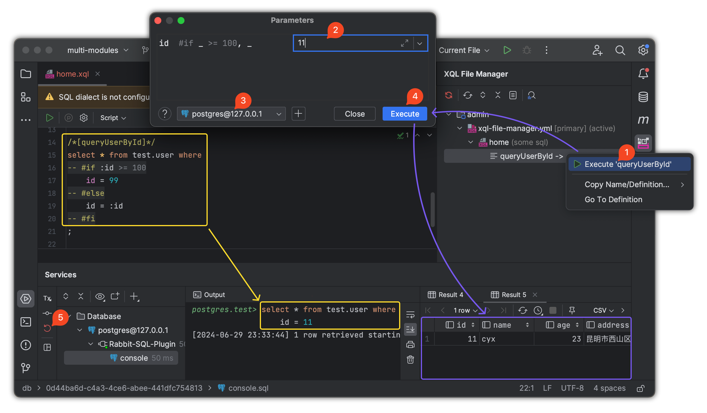

# rabbit-sql

[![License][badge:license]][license]
[![Maven][badge:maven]][maven-repository]
[![Version][badge:version]][versions]


Language: English | [简体中文](https://github.com/chengyuxing/rabbit-sql/blob/master/README.chs.md)

## Introducing

Get [Best practice](https://github.com/chengyuxing/rabbit-sql/blob/master/BEST_PRACTICE.md) or [demo](https://github.com/chengyuxing/rabbit-sql-quickstart) to quick start.

This is a lightweight persistence layer framework, provides a complete database operation solution, through encapsulation and abstraction, simplifies the complexity of database access, but also provides flexibility and scalability for developers. simple, stable and efficient as the goal, some features following:

- Native SQL executor and basic [JPA support](#JPA) for single table CRUD;
- [execute procedure/function](#Procedure);
- simple [transaction](#Transaction);
- [prepare sql](#Prepare-SQL);
- [sql in file](#XQLFileManager);
- [dynamic sql](#Dynamic-SQL);
- [interface mapping](#Interface-Mapping)

## Maven dependency (jdk1.8+)

```xml
<!-- Maven central -->
<dependency>
    <groupId>com.github.chengyuxing</groupId>
    <artifactId>rabbit-sql</artifactId>
    <version>8.1.2</version>
</dependency>
```

## Spring-Boot(2.7+) support

- support rabbit-sql autoconfigure；
- compatible with spring jdbc transaction；
- compatible mybatis、spring-data-jpaand so on to use transaction together；


Get some usage from [document](https://github.com/chengyuxing/rabbit-sql-spring-boot-starter).

## IDEA-plugin-support

Dynamic sql test:



Xql interface mapper generate:

Plugin marketplace: [Rabbit sql](https://plugins.jetbrains.com/plugin/21403-rabbit-sql) and [documentation](https://github.com/chengyuxing/rabbit-sql-plugin#readme).

## Quick start

There are two ways, Baki interface oriented and xql mapping interface oriented, that are compatible with each other.

### Init

```java
Datasource datasource = new HikariDataSource();
...
BakiDao baki = new BakiDao(dataSource);

XQLFileManager xqlFileManager = new XQLFileManager();
...
baki.setXqlFileManager(xqlFileManager);
```

### Interface-Mapping

```java
ExampleMapper mapper = baki.proxyXQLMapper(ExampleMapper.class)
```

Supports registered **xql** file mapping(`BakiDao#proxyXQLMapper`) to interface which annotated with `@XQLMapper`, do some sql operation by invoke dynamic proxy method, e.g **query** .

`example.xql`

```sql
/*[queryGuests]*/
select * from test.guest where id = :id;

/*[addGuest]*/
insert into test.guest(name, address, age)values (:name, :address, :age);
```

`ExampleMapper.java`

```java
@XQLMapper("example")
public interface ExampleMapper {
  List<DataRow> queryGuests(Map<String, Object> args);
  
  @XQL(value = "queryGuests")
  Optional<Guest> findById(@Arg("id") int id);
  
  @XQL(type = Type.insert)
  int addGuest(DataRow dataRow);
}
```

By default, all methods behaviors are depends on method prefix and sql name mapping to method name if matched, otherwise use `@XQL(value = "sql name",type = Type.insert)` annotate method to specify the sql name and modify the default query behave, methods must follow the rules:

| Sql type             | Method prefix                                              |
| -------------------- | ---------------------------------------------------------- |
| select               | select \| query \| find \| get \| fetch \| search \|create |
| insert               | insert \| save \| add \| append \|create                   |
| update               | update \| modify \| change                                 |
| delete               | delete \| remove                                           |
| procedure / function | call \| proc \| func                                       |

**Argument type:**

- **Argument dictionary**: `DataRow|Map<String,Object>|<JavaBean>`
- **Argument List**: Each argument annotated with `@Arg`

| Return Type                                            | sql Type（Type）                  | Remark                  |
| ------------------------------------------------------ | --------------------------------- | ----------------------- |
| `List<DataRow/Map<String,Object>/<JavaBean>>`          | query                             |                         |
| `Set<DataRow/Map<String,Object>/<JavaBean>>`           | query                             |                         |
| `Stream<DataRow/Map<String,Object>/<JavaBean>>`        | query                             |                         |
| `Optional<DataRow/Map<String,Object>/<JavaBean>>`      | query                             |                         |
| `Map<String,Object>`                                   | query                             |                         |
| `PagedResource<DataRow/Map<String,Object>/<JavaBean>>` | query                             | `@CountQuery`(optional) |
| `IPageable`                                            | query                             | `@CountQuery`(optional) |
| `Long`, `Integer`, `Double`                            | query                             |                         |
| `<JavaBean>`                                           | query                             |                         |
| `DataRow`                                              | query, procedure, function, plsql |                         |
| `int/Integer`                                          | insert, update, delete, ddl       |                         |

If the method annotated with special annotations, method will not mapping to xql file sql name, it just execute by the itself:

- `@Procedure`
- `@Function`

### Baki

Basic interface to access database.

#### Query

```java
baki.query("select … where id = :id").arg("id", "1")
```

```java
baki.query("&my.users")
```


> Except accept sql statement, also support accept sql by name, name start with `&` to get sql from [sql file manager](#XQLFileManager).

**Example**

- Stream-query

```java
try(Stream<DataRow> fruits = baki.query("select * from fruit").stream()){
        fruits.forEach(System.out::println);
        }
```

> Query will not truly execute until invoke **Stream terminal operation**(e.g. `foreach()` ), use jdk7 **try-with-resource** to release connection when query complete.

- Paging

Default pageable query will auto generate **paging statement** and **count** statement by database.

Built-in support oracle, mysql, postgresql, sqlite, mariadb, db2, or extends class `com.github.chengyuxing.sql.plugins.PageHelperProvider` and set to [BakiDao](#BakiDao) get support.

```java
PagedResource<DataRow> resource = baki.query("select ... where id < :id")
                .arg("id", 8)
                .pageable(1, 7)
                .collect();
```

- Custom paging

`/pgsql/data.sql`

```sql
/*[custom_paged]*/
with t as (
  select * from test.region
  where id > :id limit :limit offset :offset
)
select * from t;
;
```

```java
PagedResource<DataRow> res = baki.query("&data.custom_paged")
  		          .pageable(1, 7)
                .count("select count(*) ... where id > :id")
                .disableDefaultPageSql()
                .collect();
```

> `disableDefaultPageSql()` will not wrap sql to generate paging statement of name custom_paged.
>
> **count** statement is required now.

#### Procedure

```java
baki.of("{:res = call test.sum(:a, :b)}")
      .call(Args.of("res", Param.OUT(StandardOutParamType.INTEGER))
              .add("a", Param.IN(34))
              .add("b", Param.IN(56)))
      .getOptional("res")
      .ifPresent(System.out::println);
```

> If **postgresql**, you must use transaction when returns cursor.

#### JPA

Implemented JPA annotations: `@Entity` , `@Table` , `@Id` , `@Column` , `@Transient` , support **Lambda** style for CRUD, the CRUD logic basically follows the JPA specification.

A simple entity:

```java
@Entity
@Table(schema = "test")
public class Guest {
    @Id
    @Column(insertable = false, updatable = false)
    private Integer id;
    private String name;
    private Integer age;
    private String address;

    @Transient
    @Column(name = "count_all")
    private Integer count;
  
    // getter, setter
}
```

Query supports structure:

```sql
select ... from table [where ...] [group by ...] [having ...] [order by ...]
```

A complete example:

```sql
baki.query(Guest.class)
    .where(w -> w.isNotNull(Guest::getId)
               .gt(Guest::getId, 1)
               .and(a -> a.in(Guest::getId, Arrays.asList(1, 2, 3, 4, 5, 6, 7, 8))
                         .startsWith(Guest::getName, "cyx")
                         .or(s -> s.between(Guest::getAge, 1, 100)
                                  .notBetween(Guest::getAge, 100, 1000)
                         )
                         .in(Guest::getName, Arrays.asList("cyx", "jack"))
               )
               .of(Guest::getAddress, () -> "~", "kunming")
               .peek((a, b) -> System.out.println(a))
    )
   .groupBy(g -> g.count()
           .max(Guest::getAge)
           .avg(Guest::getAge)
           .by(Guest::getAge)
           .having(h -> h.count(StandardOperator.GT, 1))
           )
   .orderBy(o -> o.asc(Guest::getAge))
   .toList()
```

- Check the currently built SQL structure by method `peek` on the development phase.
- Support custom operator(`() -> "~"`) by invoke [operator white list](#operatorWhiteList).

**Select/update/delete** can build complex **where** nest conditions, the **having** logic same as **where**, supports the flatten style and nest style, by default multiple conditions concated by `and` .

**SQL**:

```sql
where id > 5 and id < 10 or id in (17, 18, 19)
```

**Flatten style**:

```java
.where(g -> g.gt(Guest::getId, 5))
.where(g -> g.lt(Guest::getId, 10))
.where(g -> g.or(o -> o.in(Guest::getId, Arrays.asList(17, 18, 19))))
```

**Nest style**:

```java
.where(g -> g.gt(Guest::getId, 5)
        .lt(Guest::getId, 10)
        .or(o -> o.in(Guest::getId, Arrays.asList(17, 18, 19))))
```

Notice the `and` and `or` :  adjustments have been made for most common situations: 

- all condition will be concat with `or` in the **and group**;
- all condition will be concat with `and` in the **or group**;

**SQL**:

```sql
((name = 'cyx' and age = 30) or (name = 'jack' and age = 60))
```

**Nest structure**:

```java
.where(w -> w.and(o -> o.or(a -> a.eq(Guest::getName, "cyx")
                                 .eq(Guest::getAge, 30))
                       .or(r -> r.eq(Guest::getName, "jack")
                                 .eq(Guest::getAge, 60))
               )
```

### Transaction

Use of transactions follows thread isolation:

```java
Tx.using(() -> {
  ......
});
```

## SQL parameter holder

### Prepare-SQL

Prepare sql support named parameter style, e.g. 

`:name` (jdbc standard named parameter syntax, sql will be prepare saftly, parameter name is `name` )

> Named parameter will be compile to `?`, Recommend to use prepare sql for avoid sql injection.

### String template

`${[!]name}` (string template holder, not prepare, use for sql fragment reuse)

2 styles：

- `${name}`: if value type is **boxed type array(String[], Integer[]...)** or **collection (Set, List...)**, just expand value and replace.
- `${!name}`: name start with `!`, if value type is **boxed type array(String[], Integer[]...)** or **collection(Set, List...)**, expand value and safe quote, then replace.

#### Example

sql:

```sql
select ${fields} from ... where word in (${!words}) or id = :id;
```

args:

```java
Args.<Object>of("id","uuid")
  .add("fields", Arrays.asList("name", "age"))
  .add("words", Arrays.asList("I'm OK!", "book", "warning"));
```

> Special variable type: `com.github.chengyuxing.sql.types.Variable`, for implements custom format content.

generate sql:

```sql
select name, age from ... where id in ('I''m Ok!', 'book', 'warning') or id = ?;
```

## Dynamic-SQL

Dynamic SQL depends on [XQLFileManager](#XQLFileManager), based on resolve special annotation mark, dynamic compile without breaking sql file standards.

### Annotation mark

Annotation mark must be pair and follows **open-close** tag.

#### if-else-fi

```sql
-- #if :user <> null
    ...
-- #else (optional)
    ...
-- #fi
```

#### switch-case-end

```sql
-- #switch :name
       -- #case 'a', 'b', c
       ...
       -- #break	
       -- #case 'd'
       ...
       -- #break
       ...
       -- #default
       ...
       -- #break
-- #end
```

#### choose-when-end

```sql
-- #choose
       -- #when :id >= 0
       ...
       -- #break
       ...
       -- #default
       	...
       -- #break
-- #end
```

#### for-done

```sql
-- #for item,idx of :list delimiter ',' open '' close ''
	...
-- #done
```

**For expression** syntax:

Keywords: `of` `delimiter` `open` `close`

```sql
item[,index] of :list [|pipe1|pipeN|... ] [delimiter ','] [open ''] [close '']
```

- `[...]` means optional;
- `item` is current value, `index` is current index;
- `:list` is iterator, it can be following some [pipes](#Pipe) to do something special;
- `delimiter` is a separator for concat each item,  `,` is default;
- `open` is a prefix which will pe prepend to result if result is not empty;
- `close` is a suffix which will be append to result if result is not empty.

### Expression-script

Data's key is starts with `:`.

 A simple expression syntax following: 

```sql
!(:id >= 0 || :name | length <= 3) && :age > 21
```

#### Supported operator

| Operator | Means               |
| -------- | ------------------- |
| <        | less than           |
| >        | great than          |
| >=       | great than or equal |
| <=       | less than or equal  |
| ==, =    | equal               |
| !=, <>   | not equal           |
| ~        | regex find          |
| !~       | regex not find      |
| @        | regex match         |
| !@       | regex not match     |

- Support logic symbol: `||`, `&&`, `!` ;

- Support nest bracket: `(`, `)` ;

- Support data type: string(`""`、`''`), number(12、3.14), boolean(`true` , `false`);

- Built-in constants: `null` , `blank` (`null`, empty string、empty array、empty collection);

> use custom **pipe** to implement more features.

#### Pipe

Syntax look like `:id | upper | is_id_card | ...` e.g. 


```sql
-- get value by name through length pipe and compare with number 3
:name|length <= 3
```

Implement  `com.github.chengyuxing.common.script.IPipe`  interface and add to [XQLFileManager](#XQLFileManager)  to use pipe.

**Built-In pipes:**

- **length**: get length of string value;
- **upper**: convert to upper case;
- **lower**: convert to lower case;
- **pairs**: map convert to pairs `List<Pair>` ; 
- **kv**: object or map convert to keyValues `List<KeyValue>` .

### Example

Here is about dynamic generate **named parameter sql**,  **named parameter** will be     prepare compile to `?`  to keep safe.

**for** is useful at sql `in` statement, it can be build prepared sql:

```sql
/*[query]*/
select * from test.user where id = 1
-- #for id of :ids delimiter ', ' open ' or id in (' close ')'
    -- #if :id >= 8
    :id
    -- #fi
-- #done
```

To maintain sql syntax integrity, highlighting syntax errors does not occur in ides with syntax checking, and the following equivalent writing is recommended:

```sql
select * from test.user where id = 1
-- #if :ids != blank
or id in (
    -- #for id of :ids delimiter ', '
        -- #if :id >= 8
        :id
        -- #fi
    -- #done
    )
-- #fi
;
```

```json
{"ids": [1, 2, 3, 4, 5, 6, 7, 8, 9, 10, 11, 12]}
```

example above will be generate sql and variables:

```sql
select * from test.user where id = 1
 or id in (
    :_for.id_0_7, 
    :_for.id_0_8, 
    :_for.id_0_9, 
    :_for.id_0_10, 
    :_for.id_0_11
)
```

```json
{
  "_for": {
    "id_0_0": 1,
    "id_0_2": 3,
    "id_0_1": 2,
    "id_0_10": 11,
    "id_0_11": 12,
    "id_0_4": 5,
    "id_0_3": 4,
    "id_0_6": 7,
    "id_0_5": 6,
    "id_0_8": 9,
    "id_0_7": 8,
    "id_0_9": 10
  }
}
```

For a few special places to explain:

- If for loop result is not empty, `open` means `or id in(` will prepend to result, `close` means `)` will append to result;
- Variable starts with `:` in sql means it's a named parameter which will prepare compile;

**for** work with `update` statement sets part:

```sql
/*[update]*/
update test.user
set
-- #for set of :sets | kv delimiter ', '
    ${set.key} = :set.value
-- #done
where id = :id;
```

```json
{
  "id": 10,
  "sets": {
    "name": "abc",
    "age": 30,
    "address": "kunming"
  }
}
```

example above will generate sql and variables:

```sql
update test.user
set
  address = :_for.set_0_0.value,
  name = :_for.set_0_1.value,
  age = :_for.set_0_2.value
where id = :id
```

```json
{
  "id": 10,
  "_for": {
    "set_0_2": {
      "key": "age",
      "value": 30
    },
    "set_0_1": {
      "key": "name",
      "value": "abc"
    },
    "set_0_0": {
      "key": "address",
      "value": "kunming"
    }
  }
}
```

Explain:

- `:sets` is a map, it convert to `List<KeyValue>` by pipe `kv`, so it can be work with for expression;

Concat different sql statement by database name:

```sql
/*[query]*/
select * from test.user
where id = 3
-- #if :_databaseId == 'postgresql'
    ...
-- #fi
-- #if :_databaseId == 'oracle'
    ...
-- #fi
;
```

- Built-In variable `_databaseId` is current database name.

## Appendix

A little important details you need to know.

### BakiDao

Default implement of interface **Baki**, support some basic operation.

- If [XQLFileManager](#XQLFileManager) configured ,  you can manage sql in file and support [dynamic sql](#Dynamic-SQL);

- Default named parameter start with `:` , it can be customized by specific property `namedParamPrefix`, e.g.

  ```sql
  where id = ?id
  ```

- if [pageable query](#paging) not support your database, implement custom page helper provider to property `globalPageHelperProvider` get support.

#### Options

##### autoXFMConfig

Default: `false`

Auto load xql file manager config by database name.

If `true`, find the suitable `xql-file-manager-*.yml` by database name, database name depends on **jdbc driver** `DatabaseMetaData#getDatabaseProductName().toLowerCase()` .

E.g. current database is **oracle**, it will be load `xql-file-manager-oracle.yml` first if exists, otherwise load `xql-file-manager.yml` .

##### sqlInterceptor

Custom sql interceptor, default:

```java
(sql, args, metaData) -> true
```

##### statementValueHandler

Custom prepared sql statement parameter value handler, default:

```java
(ps, index, value, metaData) -> JdbcUtil.setStatementValue(ps, index, value)
```

##### globalPageHelperProvider

Default: `null`

Global paging help provider that implements this class to override or extend if the built-in does not satisfy the current database.

##### sqlParseChecker

Default: `null`

When the dynamic sql is parsed, secondary processing is performed before it is actually executed.

##### sqlWatcher

Default: `null`

SQL Execution observer to view the execution of each sql, such as the execution time.

##### xqlFileManager

Default: `null`

XQL file manager, support unified management of SQL, according to the SQL name to obtain SQL execution, parsing dynamic SQL, support interface mapping, etc.

##### batchSize

Default: 1000

The JDBC low-level batch operation executes the number of data submitted each time.

##### namedParamPrefix

默认值：`:`

Prepared SQL named parameter prefix, used to mark the prepared parameter placeholder, and finally compiled to `?` .

##### pageKey

Default: `page`

Internal paging Query Page number Default parameter name.

##### sizeKey

Default: `size`

Internal paging Indicates the default parameter name for querying the number of entries per page.

##### queryTimeoutHandler

Default: 0

Query timeout handler, when the query times out, will throw an exception, the specific implementation effect depends on the JDBC driver: `Statement#setQueryTimeout(int)` 。

##### queryCacheManager

Default: `null`

The query cache manager caches query results to improve performance, increase concurrency, and reduce database stress.

Make a reasonable automatic cache expiration policy to prevent data from being updated in time.

##### operatorWhiteList

Default：`null`

The JPA entity query where condition builds a custom action whitelist to support other trusted, non-built-in operators.

### XQLFileManager

SQL file manager extends standard sql annotation implement more features, for support [dynamic sql](#Dynamic-SQL) and expression scripts logic judgment without breaking standard sql structure, also it's more powerful SQL file resolver.

you can get sql syntax highlight, intelligent suggestions and error check when using sql develop tools cause support sql file with extension `.sql`, dba developer     work with java developer together so easy.

Supported file extension with `.sql` or `.xql`, you can write any standard sql annotation in file, format reference `template.xql`.

:bulb: Recommend use `.xql` file to get [plugin](#IDEA-plugin-support) supports.

Every managed sql file must follows **"k-v"** structure, e.g.

`my.sql`

```sql
/*#some description...#*/
/*[query]*/
/*#some more 
  description...#*/
select * from test."user" t ${part1};

/*part 1*/
/*{part1}*/
where id = :id
${order};

/*{order}*/
order by id;

...
```

- Sql object description formatter is `/*#some description...#*/`;

- Sql object name formatter is `/*[name]*/`, sql object supports nest sql fragment by using `${fragment name}` holder; 

- Sql fragment name formatter is `/*{name}*/` , sql fragment supports nest sql fragment by using `${fragment name}` holder to reuse, as above example `my.sql`:

  ```sql
  select * from test."user" t where id = :id order by id;
  ```

#### Constructor

- **new XQLFileManager()**

  If source root `.../src/main/resources` contains file what is named `xql-file-manager.yml`, optional properties will be init by this file.

  Default options:
  
  `xql-file-manager.yml`
  
  `!path` tag use for merge list to path string.
  
  ```yaml
  constants:
  #  base: &basePath pgsql
  
  files:
  # use !path tag merge list to "pgsql/other.xql"
  #  dt: !path [ *basePath, other.xql ]
  #  other: another.xql
  
  pipes:
  #  upper: org.example.Upper
  
  delimiter: ;
  charset: UTF-8
  named-param-prefix: ':'
  database-id:
  ```
  

#### Options

##### files

Sql file mapping dictionary, key is alias, value is sql file name, you can get sql statement  by `alias.your_sql_name` when sql file added, as above example: `my.sql`;

##### pipeInstances

##### pipes

Custom [pipe](#Pipe) dictionary, **key** is pipe name, **value** is pipe class, for dynamic sql expression's value, get more [dynamic sql expression](#Expression-script)'s features by implement custom pipe;

##### delimiter

Sql file **"k-v"** structure delimiter **default `;`**, follows standard multi sql structure delimiter by `;`, but there is a condition, if you have plsql in file  e.g. `create function...` or `create procedure...`, it will be multi sql statement in one sql object, you need specific custom delimiter for resolve correctly:

- e.g. ( `;;`) double semicolon.

##### constants

String template constant pool. If there is a template placeholder for `${name}` in the SQL, look it up from the constant pool and replace it if found.

##### charset

Encoding used to parse XQL files, default: `UTF-8`。

##### namedParamPrefix

It mainly works with plug-in parsing to perform named parameter dynamic SQL.

##### databaseId

The main effect is that the plug-in parses parameters when executing dynamic SQL.


[badge:maven]:https://img.shields.io/maven-central/v/com.github.chengyuxing/rabbit-sql
[badge:license]: https://img.shields.io/github/license/chengyuxing/rabbit-sql

[badge:version]:https://img.shields.io/jetbrains/plugin/v/21403
[license]:https://github.com/chengyuxing/rabbit-sql/blob/main/LICENSE
[maven-repository]:https://central.sonatype.com/artifact/com.github.chengyuxing/rabbit-sql
[versions]:https://plugins.jetbrains.com/plugin/21403-rabbit-sql/versions
